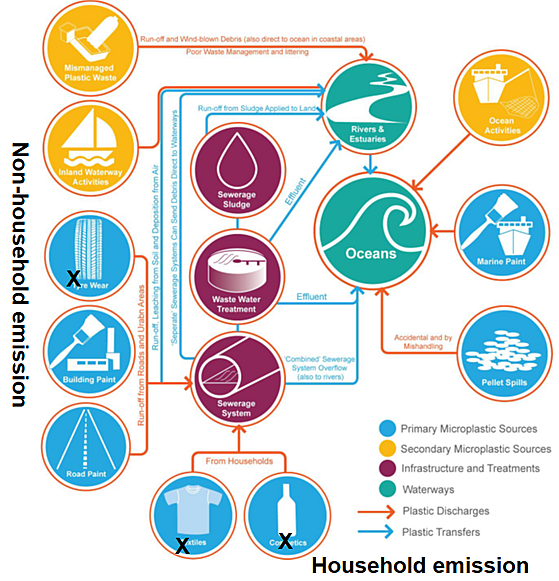
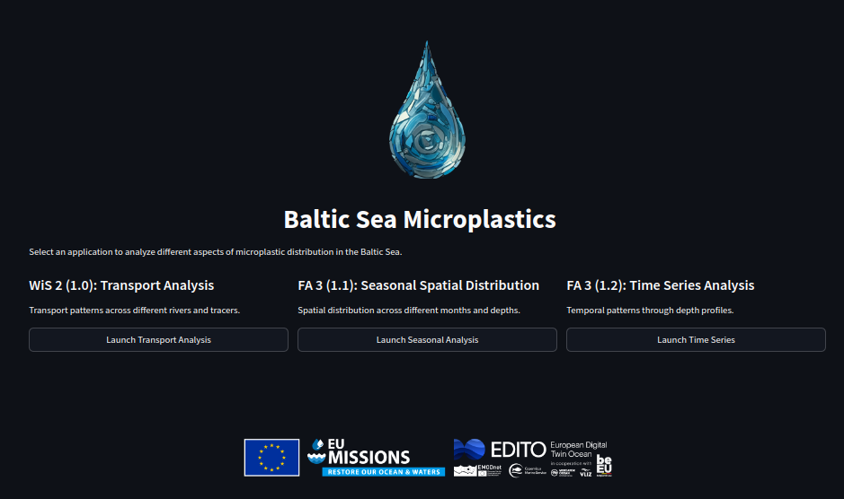
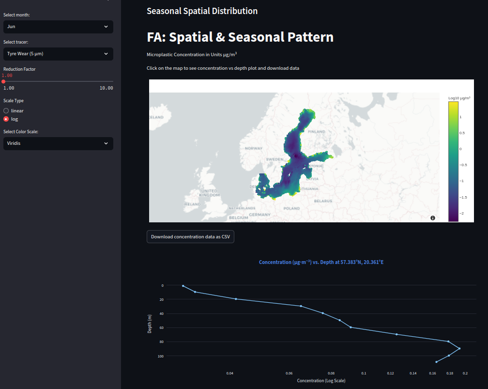
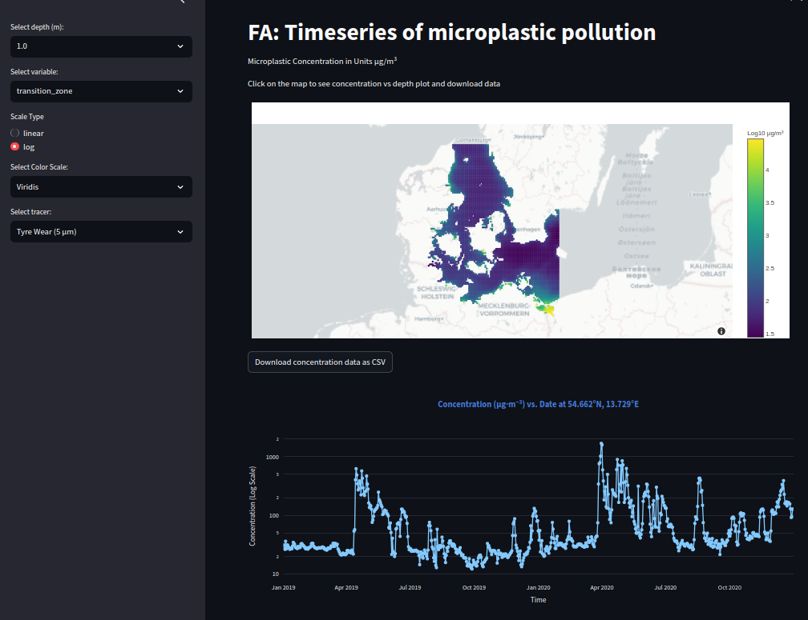

# Focus application: Fate and pathway of microplastics in the Baltic Sea (BAL-MP)


## 1. Introduction

In EU project EDITO-Model Lab, Focus Applications (FA) are developed to demonstrate the capability
of the EDITO core model suite.
Concrete, documented, and validated examples of FA will be developed in EDITO-Model Lab and
precomputed databases to address specific questions in the Ocean Mission regarding biodiversity,
zero carbon, and zero pollution.
Consolidated databases and interactive tools are provided to both intermediate users, who may use
products to develop new services, and end users such as decision makers or policy makers.
The FA "Fate and pathway of microplastics in the Baltic Sea" (BAL-MP) is one of the EDITO-Model Lab
FAs which addresses zero-pollution.



Pathways of microplastics (Adapted from Sherrington et al. 2016)

Microplastic pollution in the ocean is an emerging problem due to the small size of the particles
(diameter: ≤ 5mm), their longevity, and their efficient spreading behavior in the marine
environment.
It has therefore been recognized as a potential risk for marine health.
Figure 1 shows sources and pathways of microplastics in the environment.
Microplastics are emitted from land to sea through human-related processes, e.g., tyre wear and
tear, Personal Care and Cosmetic Products (PCCP), and laundry.
According to research in EU project CLAIM (She et al., 2021), each year at least 9,144 tons of tyre
wear microplastics, 30.5 tons of PCCP microplastics, and 19-45 tons of microplastic fibres from
laundry enter the Baltic Sea.
The BAL-MP provides tailored data products and interactive visualization tools for the assessment
of microplastic pollution patterns in the Baltic Sea and to estimate transport in the marine
environment.

The data products in BAL-MP include 3 types of microplastics:
1. Small-size (5 μm) tyre wear particles, which are denser than seawater Average size (42 μm) household-microplastics, 
representing the majority of microplastics discharged from Waste Water Treatment Plants (WWTPs) Large size (300 μm) particles 
which are lighter than seawater and initially float near the surface

All microplastics are generated on land and then discharged to the catchments, rivers, and finally
to the sea.
Detailed source mapping assessments have been carried out to quantify the amount of released
microplastics per day for all Baltic Sea rivers and coastal catchments by using results from the
CLAIM project (She et al., 2021).
The released microplastic particles are carried offshore with the currents and wave-induced
transport (Frishfelds et al., 2022).
The coupled ocean circulation, wave, and microplastic transport model (Murawski et al., 2022) uses
the wave-induced momentum contribution derived from the modelled radiation stresses to drive the
transport currents.
Microplastics are treated as spherical particles of given size and density.
The model uses Stokes' law to calculate the vertical velocity dependent on the size and density of
the particles.
Microplastics particles that are lighter than seawater float near the surface, whereas heavier
particles sink to the seabed.
Biofouling has been implemented as a removal process to overcome the particles' buoyancy with time.
The model describes the growth of a heavier biofilm shell surrounding the particle.
Eventually, all microplastic particles either transport to the North Sea or sink to the seabed
where they are embedded into the sediments and removed from the ocean budget.

Marine plastic pollution focus-applications provide four functions:
1. Spatial and temporal data products based on monthly mean climatology Time series extraction for user-selected locations 
Annual mean transport and budget calculations for user-defined domains Residence pattern analysis for the entire Baltic Sea

These products have been integrated into one data visualization and download service.

## 2. Data products

### 2.1 Spatial and seasonal microplastic pollution pattern in the Baltic Sea 

Spatial and Seasonal pattern of microplastic pollution in the Baltic Sea are provided as monthly
mean climatology of three-dimensional, spatial microplastic pollution pattern derived from the 6
years HBM-MP modeldata set covering the years 2014-2019.
The spatial resolution is 0.5', roughly 900 m. The product includes data layers for 15 vertical
levels at varying depth and one additional layer for the microplastic concentrations near the
seabed.
The depth of the vertical layers increases from the surface to the bottom.

The data is stored in Zarr format, which provides efficient access to large multidimensional arrays. 
The data is described in 
[this STAC (SpatioTemporal Asset Catalog) for the seasonal-spatial product](https://radiantearth.github.io/stac-browser/#/external/minio.dive.edito.eu/oidc-jola/datasets_stac/datasets_microplastics_fa3_1_1_microplastic_seasonal_spatial/datasets_microplastics_fa3_1_1_microplastic_seasonal_spatial_baltic_sea/datasets_microplastics_fa3_1_1_microplastic_seasonal_spatial_baltic_sea.json)
and 
[this STAC for the microplastics transport product](https://radiantearth.github.io/stac-browser/#/external/minio.dive.edito.eu/oidc-jola/datasets_stac/datasets_microplastics_fa3_1_1_microplastic_seasonal_spatial/datasets_microplastics_fa3_1_1_microplastic_seasonal_spatial_baltic_sea/datasets_microplastics_fa3_1_1_microplastic_seasonal_spatial_baltic_sea.json).


The STAC catalog provides metadata about the dataset including its spatial extent, available variables, and access information. 
The data can be accessed either remotely or locally using Python libraries such as xarray, 
which provides a convenient interface for working with this data, in addition to the service provided via the EDITO platform.

### 2.2. Time series 3D microplastic pollution in the Baltic Sea 

Time series of microplastic concentrations for Baltic Sea locations can be extracted from a 2-year
data set (EDITO-data set) covering the years 2018-2019.
The data set includes all model layers, which may vary in spatial resolution from model domain to
model domain.
There are 2 domains covering the Baltic Sea: Danish Straits domain (number 2), with a horizontal
resolution of 0.5' (roughly 900 m), and the Baltic Sea domain (number 4), with a horizontal
resolution of 1' (roughly 1852 m).
The Danish straits domain covers the area from the Skagerrak to Bornholm, whereas the Baltic Sea
domain covers the area east and north of Bornholm.
Vertically, the Danish straits and Baltic Sea domains are resolved with model layers of 2 m
thickness at the surface and 1 m layers down to a depth of 100 meter.
Below 100 m depth, the layer thickness increases gradually with depth.

### 2.3 Assessing microplastic transport and budget

*[This function is not ready yet.]*

Microplastic transport and budget assessment tool allow it to visualize the annual mean transport
across the interfaces of a user specified, rectangular domain and to calculate a budget for the
specified domain.
The tool analyses the transport in and out of the domain and calculates a mass-budget based on the
annual mean concentration within the domain and the annual mean discharge of microplastics from
rivers and coastal catchments.
The budget is calculated for three types of microplastics, from tyre wear and household
microplastics.

The method uses the annual mean microplastic transport (year 2018) which was calculated for each
model grid cell using the EDITO-data set of ocean transport currents and microplastic
concentrations.
Following the Arakawa-C grid definition, the transport across the southern, eastern and lower side
of the rectangular grid cells is calculated.
The transport across the northern, western and upper side is available from the transport
calculations for neighboring grid cells.
Users can specify a rectangular domain by defining the longitude and latitude range it shall cover.
The budget calculation tool identifies the model grid cells that are closest to the sides of the
specified domain and calculates the transport across the specified interfaces.
From this and the knowledge of the sources and the amount of microplastics inside the domain, the
microplastic budget is calculated.

### 2.4. Spatial residence pattern analysis

Spatial residence patterns provide an overview over the percentage number of days with microplastic
concentration larger than a user specified lower concentration level.
By selecting a lower level, the user can visualize residence pattern for the available 3
microplastic types: tyre wear and average and large size household microplastics.
The product includes data layers for the surface and near the seabed, defined by the deepest model
layer.
It should be mentioned that the near seabed pattern shows the concentration value in the sea and
not in the sediments.
Sedimentation is the process that leads to removal of microplastics from the ocean, reducing the
concentrations in the deepest model layer.

The data files contain residence pattern maps for 83 concentration levels, spanning 9 magnitudes of
concentration values (see Table 1).
Each magnitude is covered by 9 concentration values of 1/10-th of the magnitude.

| Microplastic type              | Residence pattern concentration range |
|--------------------------------|---------------------------------------|
| Tyre wear microplastic         | 0 g/m^3^, 10^-9^ g/m^3^ , .... , 1.0 g/m^3^ |
| Average size household microplastic | 0 g/m^3^, 10^-10^ g/m^3^ , .... , 0.1 g/m^3^ |
| Large size household microplastic | 0 g/m^3^, 10^-11^ g/m^3^ , .... , 0.01 g/m^3^ |

Table 1: Range of microplastic concentrations covered by the residence pattern analysis.

The entire CLAIM data set covering 6.5 years, from the start of the simulation in July 2013 to
January 2020 were analyzed.
The input data set includes 2374 daily files.

Data Source:

- CLAIM data set: 0.5\' (\~1 km) horizontal resolution in the entire Baltic Sea and Danish Straits. The data set covers 
a 6.5 years period: July 2013 to January 2019. Daily files of microplastic concentrations at midnight are available. 
This data set is used for microplastic statistics: spatial patter: montly mean climatology maps and spatial residence pattern assessments.

- EDITO data set: 1\' (\~1.8 km ) horizontal resolution in the Baltic Sea and 0.5\' (\~1 km) in the Danish Straits. 
The data set covers a 4 years period January 2017 to December 2020. Daily restart files containing information on the 
microplastic concentrations at midnight are available. Hourly files (tempdat files) containing information on the 
ocean circulation parameter are available. This data set is used for time series extraction and microplastic budget calculations.


## 3. Service description

### 3.1 Overview

This service provides interactive visualization and analysis capabilities for microplastic distribution in the Baltic Sea region. 
The data is stored in Zarr format, providing efficient access to large-scale scientific datasets.

### 3.2 Data Specifications

#### 3.2.1 Time Period and Units

- Time Period: 2019-2020
- Measurement Units: Microplastic concentration in μg/m³
- Data Format: Zarr arrays
- Data Source: EDITO project (2018-2019)

#### 3.2.2 Spatial Coverage

The data covers different regions of the Baltic Sea area:

1. **Seasonal Spatial Distribution (FA 3.1.1)**
   - Covers: 53.62°N-65.88°N, 9.36°E-30.31°E
   - Includes the entire Baltic Sea basin

2. **Time Series Analysis (FA 3.1.2)**
   - Baltic Sea region: 53.96°N-65.89°N, 14.60°E-30.26°E
   - Transition Zone: 53.60°N-57.60°N, 9.34°E-14.78°E
   - Wadden Sea: 53.23°N-55.69°N, 6.18°E-10.40°E

### 3.3 Service Components

When you first access the service, you'll see the landing page with three main applications:



The service consists of:

1. **Transport Analysis (WIS 2 1.0)**
   - Transport patterns across different rivers and tracers
   - Version 1.0: Transport Analysis
   
2. **Seasonal Spatial Distribution (FA 3.1.1)**
   - Spatial distribution across different months and depths
   - Version 1.1: Seasonal Analysis
   
3. **Time Series Analysis (FA 3.1.2)**
   - Temporal patterns through depth profiles
   - Version 1.2: Time Series Analysis

### 3.4 Component Usage

#### 3.4.1 Seasonal Spatial Distribution Tool (FA 3.1.1)



The seasonal distribution view shows microplastic concentrations across the Baltic Sea for different months. The interface consists of:

**Left Panel Controls**

- Select month: Choose which month to view
- Select tracer: Pick the type of microplastic tracer (e.g., Tyre Wear 5 μm)
- Reduction Factor: Simulate the effect reducing microplastics emissions by a given factor
- Scale Type: Toggle between linear and log scales
- Select Color Scale: Choose color scheme (e.g., Viridis)

**Main View**

- Map shows concentration distribution using color coding
- Darker blues indicate lower concentrations
- Yellows/greens indicate higher concentrations
- Click any point to see the depth profile below
- Concentration scale shown on the right (Log10 μg/m³)
- The title displays the coordinate of the corresponding time series; click on it to open the location on Google Maps.


#### 3.4.2 Time Series Analysis Tool (FA 3.1.2)



The time series view allows you to analyze concentration changes over time. The interface includes:

**Left Panel Controls**

- Select depth: Choose depth layer (e.g., 1.0 m)
- Select variable: Choose region (transition_zone shown)
- Scale Type: Toggle between linear and log scales
- Select Color Scale: Choose visualization colors (e.g., Viridis)
- Select tracer: Pick microplastic tracer type

**Main View**

- Map shows spatial distribution at selected depth
- Time series plot appears when you click a location
- Data ranges from Jan 2019 to Oct 2020
- Download option for CSV data of time series
- The title displays the coordinate of the corresponding time series; click on it to open the location on Google Maps.

### 3.5 Interface Tips

1. **Map Navigation**
   - Zoom: Use mouse wheel or pinch gesture
   - Pan: Click and drag on the map
   - Reset: Double-click to reset view

2. **Data Analysis**
   - Use logarithmic scale for wide concentration ranges
   - Compare different months to observe seasonal patterns
   - Export data for offline analysis using the CSV download option

### 3.6 Data Access

#### 3.6.1 STAC Catalog

The data is available through a STAC (SpatioTemporal Asset Catalog) which provides standardized metadata about the datasets. 
The main catalog can be accessed at: https://minio.dive.edito.eu/oidc-jola/datasets_stac/catalog.json

#### 3.6.2 Programmatic Access

Example Python code for accessing the data:

```python
import xarray as xr
import fsspec

# STAC catalog URL
catalog_url = "https://minio.dive.edito.eu/oidc-jola/datasets_stac/datasets_microplastics_fa3_1_1_microplastic_seasonal_spatial/catalog.json"

# Access seasonal spatial data
seasonal_url = "https://minio.dive.edito.eu/oidc-jola/datasets/microplastics/fa3_1_1_microplastic_seasonal_spatial/baltic_sea.zarr"
ds_seasonal = xr.open_zarr(fsspec.get_mapper(seasonal_url))

# Access timeseries data
timeseries_url = "https://minio.dive.edito.eu/oidc-jola/datasets/microplastics/fa3_1_2_microplastic_timeseries/baltic_sea.zarr"
ds_timeseries = xr.open_zarr(fsspec.get_mapper(timeseries_url))
```

#### 3.6.3 Dataset Specifications

**Seasonal Data (FA 3.1.1)**

- Spatial coverage: 53.62°N-65.88°N, 9.36°E-30.31°E
- Dimensions: depth (15 layers), latitude (369), longitude (378), month (12), tracer (3)
- Variables: mpl_3d, mpl_sb
- Regular lat-lon grid with varying vertical resolution

**Timeseries Data (FA 3.1.2)**

Three separate datasets with different spatial coverage:

1. **Baltic Sea**
   - Coverage: 53.96°N-65.89°N, 14.60°E-30.26°E
   - Dimensions: depth (122), latitude (180), longitude (142), time (755), tracer (3)

2. **Transition Zone**
   - Coverage: 53.60°N-57.60°N, 9.34°E-14.78°E
   - Dimensions: depth (77), latitude (121), longitude (99), time (755), tracer (3)

3. **Wadden Sea**
   - Coverage: 53.23°N-55.69°N, 6.18°E-10.40°E
   - Dimensions: depth (24), latitude (38), longitude (39), time (755), tracer (3)

All timeseries datasets:
- Variables: tracers 
- Time range: 2019-01-01 to 2020-12-31

## 4. Scientific background information

Modelling microplastics in the marine environment involves all important processes that influence
the life-span of the pollutants, from their production on land to their final embedding into the
sediments.
The modelling approach integrates the (1.) mapping and quantification of the coastal sources, (2.)
the wave and current induced transport to offshore areas and (3.) the modelling of the fate of
microplastic pollutants, i.e. biofouling, sinking and sedimentation (Murawski et al., 2022; She et
al., 2023 and Frishfelds et al. 2023).

Coastal sources of microplastic in the Baltic Sea were assessed in the H2020 EU-Project CLAIM
"Cleaning Litter by Developing & Applying Innovative Methods".
The report D1.2 "Marine plastic litter source dataset in the Baltic and Mediterranean Sea" (She et
al., 2021) lists the annual discharge in numbers of tonnes per year (t/y) for each of the 455 rivers
and coastal catchments in the Baltic Sea.
The data set bases on an extensive literature and source mapping study, including a model study of
microplastic pathways from the roads and households through waste water treatment facilities into
the catchments and rivers, using population density and urbanization maps, river catchment maps and
simple river retention models.
The ocean transport and fate model uses annual mean concentration values to calculate the river
discharge of microplastics.
These are calculated by dividing the annual mean discharge (t/y) with the annual fresh water inflow
volume (m^3^/y).
The microplastic concentration in the rivers does not change over the course of the year, but the
microplastic discharge changes with the amount of fresh water entering the Baltic Sea.

This study involves three types of microplastics: tyre wear microplastics and two types of
household microplastics, which differ in density and size (see table).
Tyre wear microplastics (5 μm), featuring a small size and a densities larger than sea water,
represent the size fraction, smaller than 20 μm.
Household microplastics of average size (42 μm) represent the most commonly measured fraction in
the effluents of waste water treatment plants.
The large fraction of household microplastics (300 μm) on the other hands represents the most
commonly used mesh size of the filtering devices that are used to measure microplastics at sea.
The larger fraction has been used for comparison studies with observed concentrations.

Ocean transport of microplastic pollutants is handled by eulerian tracers advection and dispersion
module of the HBMos ocean circulation model.
The coupled wave-and-ocean circulation model used the wave-induced momentum contribution (wave
force, i.e. divergence of the radiation-stress) to model the combined, ocean wave and current
dependent transport.
Near the coast, this leads to the well-known wave setup and coastal currents during events with
significant wave heights.
Vertical and horizontal mixing was handled by the HBMos k-ω turbulence and mixing model in the
vertical and the Smagorinski model in the horizontal.
This ensures the efficient spreading of the microplastic tracers.

The removal of microplastics through sinking and sedimentation involves the Stokes law for
spherical particles.
The vertical velocity depends on the particle size, the density and the eddy viscosity of the
surrounding water mass.
So, in the usually well mixed surface layer, the sinking velocity is smaller than in the layers
below.
The size dependency of the sinking velocity means that small particles like tyre wear microplastics
(diameter 5 μm) sink slower than larger particles.
Household microplastics on the other hand have a larger diameter, but feature a density that is
initially smaller than the one of sea water.
They float, until a heavier biofilm shell forms around the particles that grows and eventually
leads to overloading.
A biofilm model has been implemented that describes the density of the microplastic particles as a
function of biofilm growth, using assumption on the available nutrients for algae growth.
The model has been tuned intensively to achieve realistic microplastic concentrations and fairly
stable seasonal cycles throughout the interannual model simulation.
Growth rates have been defined following suggestions from the existing literature.
The number of experimental studies, however, is relatively small.
Therefore, it remains difficult to parameterize the growth process correctly, especially in the
northern Baltic Sea, the Bay of Bothnia, where algae growth is limited by the harsh climate,
seasonal ice cover and the low light conditions during winter.

## 5. References

Frishfelds, V., Murawski, J., She, J. (2022).
Transport of Microplastics From the Daugava Estuary to the Open Sea, Frontiers in Marine Science,
9, doi: 10.3389/fmars.2022.886775

Murawski, J., She, J., Frishfelds, V. (2022).
Modeling drift and fate of microplastics in the Baltic Sea.
Frontiers in Marine Science, 9, doi: 10.3389/fmars.2022.886295

She, J., Christensen, A., Garaventa, F., Lips, U., Murawski, J., Ntoumas, M., and Tsiaras, K.
(2023).
Developing Realistic Models for Assessing Marine Plastic Pollution in Semi-Enclosed Seas.
Oceanography 36, no.
1: 54--57.
https://www.jstor.org/stable/27217378.

She, J., Tsiaras, K., Hatzonikolakis, I., Gkanasos, A., Zeri, C., Murawski, J. and Lips, I. (2021).
Marine plastic litter source dataset in the Baltic Sea and Mediterranean Sea, CLAIM project report
(D1.2), https://www.claim-h2020project.eu/deliverables/


---

