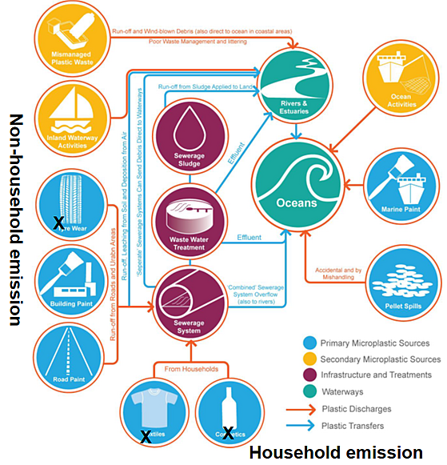

# What-if Scenario: Microplastic cleaning scenarios in the Baltic Sea

## Introduction

In EU project EDITO-Model Lab, What-if Scenario (WiS) are developed to demonstrate capability of
the EDITO core model suite.
Concrete and documented examples of WiS will be developed in EDITO-Model Lab and precomputed and/or
on-demand datasets to address specific questions in the Ocean Mission regarding biodiversity, zero
carbon and zero pollution.
Consolidate datasets and interactive tools are provided to both intermediate users who may use
products to develop new services and end users such as decision makers or policy makers.
The WiS "Microplastic cleaning scenarios in the Baltic Sea" (BAL-MP-WiS) is one of the EDITO-Model
Lab WiSs which is addressing zero-pollution efforts.

Addressing offshore microplastic pollution requires the development of efficient cleaning
strategies of land-based sources.
Transport and fate modelling for individual rivers and coastal sources can provide the basis for
the characterization of microplastic impacts near the coast and offshore (Murawski et al., 2022; She
et al., 2023; Frishfelds et al, 2022).
These in turn can provide quantitative measures for the evaluation of cleaning impacts, i.e. the
level of concentration reduction and the amount of removed microplastics through cleaning in a given
area.
Together with additional (unprovided) information on the cleaning capacity and the cost of the
cleaning for a given technology, users can use this what-if scenario to define cost efficient
cleaning strategies (Christensen et al., 2021).

What-if scenarios for studying microplastic discharge of 13 of the largest rivers in the Baltic Sea
and the Danish Straits have been developed from model simulations covering the year 2018. For each
of the rivers and microplastic type, individual microplastic transport and fate simulations were
carried out.
The model data set includes daily 3D distributions of microplastic concentrations in grams per
cubic meter (g/m³) for 3 fractions of different density and diameter, for tyre wear and household
microplastics (https://doi.org/10.3389/fmars.2022.886295).
The data set represents the microplastic distributions after 1 year of simulation at the 31th of
December 2018.

The what-if scenario uses scalable pollution pattern from individual rivers, i.e. derived Greens
Functions to assess the coverage and impact, in terms of concentration levels.
The effect of cleaning will be accessible using the derived Greens Functions, i.e. the local
concentrations divided by the total amount of discharged microplastics.
The Greens Functions can be used to reconstruct the concentration pattern for a given cleaning
scenario by multiplying them with the total amount of released microplastic for the given scenario.
It has been shown in the CLAIM project that the pollution concentration level in the Baltic Sea
scale roughly linearly with the concentration level in the rivers, which is the perquisite for using
Greens Functions.

The model treats three types of microplastics:
1. Small-size (5 μm) tyre wear particles, which are denser than sea water 
2. Average size (42 μm) household-microplastics, representing majority of microsplastics discharged from  Waste Water Treatment Plants (WWTP)s 
3. Large size (300 μm) household-microplastics which are lighter than sea water and initially float near the surface

All the microplastics are generated on land and then discharged to the catchments, rivers and
finally to the sea.
Detailed source mapping assessments have been carried out to quantify the amount of released
microplastics per day, for all Baltic Sea rivers and coastal catchments by using results from CLAIM
project.
Figure 1 show sources and pathways of microplastics in the environment.
Microplastics emitted from land to sea through human-related processes, e.g. tyre wear and tear,
Personal Care and Cosmetic Product (PCCP) and laundry.
According to research in EU project CLAIM (She et al 2021), each year there are at least 9,144 tons
tyre wear microplastics, 30.5 tons PCCP microplastics and 19-45 tons microplastic fibers from
laundry wear that are entering the Baltic Sea.
The released microplastic particles are carried offshore with the currents and the wave-induced
transport.
The model includes biofouling as a removal process to overcome the particles buoyancy with time.
Eventually all microplastic particles are either transported to the North Sea or sink to the seabed
where they are embedded into the sediments and removed from the ocean budget.

Pathways of microplastics (Adapted from Sherrington et al. 2016)

## 2. Data products

Marine plastic pollution what-if scenarios provide answers to following three questions:
1. What is spatial distribution of microplastics in the Baltic Sea if only one given river discharges microplastics? 
2. If one reduces discharges of micropalstics from multiple given rivers, what will be the impact on the micropalstic distribution in the sea? 
3. For a given offshore location, what is attribution to individual rivers?

The answers to the three questions are addressed by three data products:
1. Pollution pattern for individual rivers 
2. Pollution reduction assessment for a given set of rivers 
3. Attribution of offshore concentrations to individual rivers in the entire Baltic Sea

These products have been integrated into one data visualization and download service.

The data product (1.) is made for 13 of the largest Baltic Sea rivers, provides information on the
horizontal distribution of microplastics from tyre wear and household sources at the surface,
vertically integrated and near the seabed in the Baltic Sea and the transition zone to the North
Sea.
The product covers also the North Sea, although no North Sea sources have been taken into
consideration.
The data set is available in units of a mass concentrations, i.e. in units of gram per cubic meter
(g/m³).

# 3. Service Description

### 3.1 Overview

The What-if Scenario (WiS) service provides interactive visualization and analysis capabilities for simulating microplastic cleaning scenarios in the Baltic Sea region. The interface allows users to explore the impact of reducing microplastic discharge from specific rivers and analyze the resulting spatial distribution patterns through an intuitive visualization interface.

### 3.2 Interface Components

The WiS interface consists of two main sections:

#### Left Panel Controls

1. **River Selection**
   - Dropdown menu to choose from 13 major Baltic Sea rivers (e.g., "Neva (Russia)" shown in screenshot)
   
2. **Tracer Selection**
   - Options for different microplastic types:
     - Large Household (300 μm)
     - Average Household (42 μm)
     - Tyre Wear (5 μm)

3. **Visualization Controls**
   - Coarsening Factor slider (1-10)
     - Adjusts the spatial resolution of the visualization
   - Number of Contour Levels slider (2-20)
     - Controls the detail level of concentration boundaries
   
4. **Display Options**
   - Scale Type toggle
     - Linear: For direct concentration values
     - Log: For better visualization of wide concentration ranges
   - Color Scale selector (e.g., Viridis)
     - Various color schemes for different visualization needs
   - Variable selector (mpl_surf shown)
     - Surface concentrations
     - Seabed concentrations
     - Integrated concentrations

#### Main Visualization Panel

The main panel displays:

1. **Concentration Map**
   - Color-coded contour plot showing microplastic concentrations
   - X-axis: Longitude (0-70°E)
   - Y-axis: Latitude (-20-80°N)
   
2. **Legend**
   - Color scale showing concentration values
   - Log10 scale of concentrations in g/m³
   - Range from -9 (lowest) to approximately -0.737 (highest)

3. **Geographical Features**
   - Baltic Sea coastline
   - Coordinate grid for precise location reference
   - High-resolution contours showing concentration gradients

### 3.3 Using the Interface

1. **Selecting Study Parameters**
   - Choose a river from the dropdown to analyze its contribution
   - Select the type of microplastic tracer to study
   - Adjust the coarsening factor for performance vs. detail
   
2. **Optimizing Visualization**
   - Use the log scale for wide concentration ranges
   - Adjust contour levels for desired detail
   - Select appropriate color scales for your analysis needs
   
3. **Analyzing Results**
   - Examine concentration patterns around source rivers
   - Compare different tracer types' dispersion patterns
   - Study concentration gradients from coast to open sea

### Data Source

EDITO data set: 1' (~1.8 km) horizontal resolution in the Baltic Sea and 0.5' (~1 km) in the Danish
Straits.
The data set represents the microplastic concentrations after 1 year of model simulation at the
31th December 2018. The ocean circulation model simulations were started in July 2016 and run for an
initial period of 1.5 years until the 1th of January 2018 to spin-up the model.
Then, the release of microplastic pollutants was initiated.
Daily restart files containing information on the microplastic concentrations at midnight are
available.
The midnight data set at the 31th of January 2018 has been used for the Greens function calculation.
Horizontal maps at the surface and near seabed (deepest model grid cell) have been provides as
separate data layers.
These represent the topmost and the deepest model layer, which may vary in thickness and horizontal
resolution dependent on the model domain.
There are 2 domains covering the Baltic Sea: Danish Straits domain, with a horizontal resolution of
0.5' (roughly 900 m), and the Baltic Sea domain, with a horizontal resolution of 1' (roughly 1852
m).
The Danish straits domain covers the area from the Skagerrak to Bornholm, whereas the Baltic Sea
domain covers the area east and north of Bornholm.
Vertically, the Danish straits and Baltic Sea domains are resolved with model layers of 2 m
thickness at the surface and 1 m layers down to a depth of 100 meter.
Below 100 m depth, the layer thickness increases gradually with depth.

### Scientific Background

Modelling microplastics in the marine environment involves all important processes that influence
the life-span of the pollutants, from their production on land to their final embedding into the
sediments.
The modelling approach integrates the:
1. Mapping and quantification of the coastal sources The wave and current induced transport to offshore areas The modelling of the fate of microplastic pollutants, i.e. biofouling, sinking and sedimentation  (Murawski et al., 2022; She et al., 2023 and Frishfelds et al. 2023)

Coastal sources of microplastic in the Baltic Sea were assessed in the H2020 EU-Project CLAIM
"Cleaning Litter by Developing & Applying Innovative Methods".
The report D1.2 "Marine plastic litter source dataset in the Baltic and Mediterranean Sea" (She et
al., 2021) lists the annual discharge in numbers of tonnes per year (t/y) for each of the 455 rivers
and coastal catchments in the Baltic Sea.
The data set bases on an extensive literature and source mapping study, including a model study of
microplastic pathways from the roads and households through waste water treatment facilities into
the catchments and rivers, using population density and urbanization maps, river catchment maps and
simple river retention models.
The ocean transport and fate model uses annual mean concentration values to calculate the river
discharge of microplastics.
These are calculated by dividing the annual mean discharge (t/y) with the annual fresh water inflow
volume (m³/y).
The microplastic concentration in the rivers does not change over the course of the year, but the
microplastic discharge changes with the amount of fresh water entering the Baltic Sea.

This study involves three types of microplastics: tyre wear microplastics and two types of
household microplastics, which differ in density and size (see table).
Tyre wear microplastics (5 μm), featuring a small size and a densities larger than sea water,
represent the size fraction, smaller than 20 μm.
Household microplastics of average size (42 μm) represent the most commonly measured fraction in
the effluents of waste water treatment plants.
The large fraction of household microplastics (300 μm) on the other hands represents the most
commonly used mesh size of the filtering devices that are used to measure microplastics at sea.
The larger fraction has been used for comparison studies with observed concentrations.

Ocean transport of microplastic pollutants is handled by eulerian tracers advection and dispersion
module of the HBMos ocean circulation model.
The coupled wave-and-ocean circulation model used the wave-induced momentum contribution (wave
force, i.e. divergence of the radiation-stress) to model the combined, ocean wave and current
dependent transport.
Near the coast, this leads to the well-known wave setup and coastal currents during events with
significant wave heights.
Vertical and horizontal mixing was handled by the HBMos k-ω turbulence and mixing model in the
vertical and the Smagorinski model in the horizontal.
This ensures the efficient spreading of the microplastic tracers.

The removal of microplastics through sinking and sedimentation involves the Stokes law for
spherical particles.
The vertical velocity depends on the particle size, the density and the eddy viscosity of the
surrounding water mass.
So, in the usually well mixed surface layer, the sinking velocity is smaller than in the layers
below.
The size dependency of the sinking velocity means that small particles like tyre wear microplastics
(diameter 5 μm) sink slower than larger particles.
Household microplastics on the other hand have a larger diameter, but feature a density that is
initially smaller than the one of sea water.
They float, until a heavier biofilm shell forms around the particles that grows and eventually
leads to overloading.
A biofilm model has been implemented that describes the density of the microplastic particles as a
function of biofilm growth, using assumption on the available nutrients for algae growth.
The model has been tuned intensively to achieve realistic microplastic concentrations and fairly
stable seasonal cycles throughout the interannual model simulation.
Growth rates have been defined following suggestions from the existing literature.
The number of experimental studies, however, is relatively small.
Therefore, it remains difficult to parameterize the growth process correctly, especially in the
northern Baltic Sea, the Bay of Bothnia, where algae growth is limited by the harsh climate,
seasonal ice cover and the low light conditions during winter.

### References

Christensen, A., Tsiaras, K., Murawski, J., Hatzonikolakis, Y., She, J., St. John, M., Lips, U. and
Brouwer, R. (2021).
A Cross Disciplinary Framework for Cost-Benefit Optimization of Marine Litter Cleanup at Regional
Scale.
Frontiers in Marine Science, 8, doi: 10.3389/fmars.2021.744208

Frishfelds, V., Murawski, J., She, J. (2022).
Transport of Microplastics From the Daugava Estuary to the Open Sea, Frontiers in Marine Science,
9, doi: 10.3389/fmars.2022.886775

Murawski, J., She, J., Frishfelds, V. (2022).
Modeling drift and fate of microplastics in the Baltic Sea.
Frontiers in Marine Science, 9, doi: 10.3389/fmars.2022.886295

She, J., Christensen, A., Garaventa, F., Lips, U., Murawski, J., Ntoumas, M., and Tsiaras, K.
(2023).
Developing Realistic Models for Assessing Marine Plastic Pollution in Semi-Enclosed Seas.
Oceanography 36, no.
1: 54-57.
https://www.jstor.org/stable/27217378

She, J., Tsiaras, K., Hatzonikolakis, I., Gkanasos, A., Zeri, C., Murawski, J. and Lips, I. (2021).
Marine plastic litter source dataset in the Baltic Sea and Mediterranean Sea, CLAIM project report
(D1.2), https://www.claim-h2020project.eu/deliverables/

---

