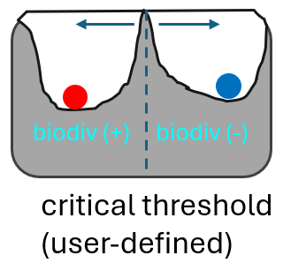
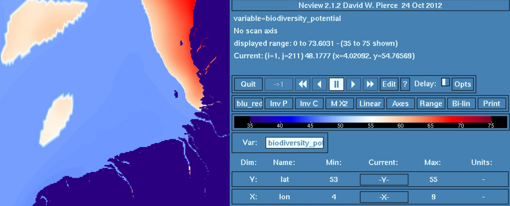

#### Developer: [Helmholtz-Zentrum hereon](https://www.hereon.de/index.php.en) - Helmholtz-Zentrum hereon, Germany
 
|  |
|  |
 
 
# EDITO-Model Lab's Focus Applications (FAs) and What-if Scenarios (WiSs)
 
The European Digital Twin of the Ocean (EDITO) will provide an innovative set of user-driven and interactive decision-making tools. 
Within that framework, EDITO-Model Lab’s Focus Applications are demonstrators of the capabilities of the next generation of ocean models that the project is building. 
We will deliver our Focus Applications with high technology readiness level within three thematic areas that are related to key EU policy questions: marine biodiversity, 
greenhouse gas emissions from maritime shipping, and marine pollution. 
You can read about the ADDED VALUE OF THE EDITO-MODEL LAB FOCUS APPLICATIONS [here](https://edito-modellab.eu/news/what-is-the-added-value-of-the-edito-model-lab-focus-applications-nbsp).
 
# Background of this Focus application - FA-1 on MPAs for Biodiversity
 
## Focus application for Marine biodiversity
 
Developments in science and society in recent decades have increasingly recognised and highlighted the importance of biodiversity for healthy ecosystems. In the face of accelerating climate change and the increasing intensity and scale of human interventions, the importance of biodiversity for ecosystem resilience has also been demonstrated. Last but not least, biodiversity is a central theme of the United Nations Sustainable Development Goals (SDGs). Biodiversity is also of particular importance in the Green Deal, the main European initiative to mitigate climate change, as many Green Deal activities affect marine ecosystems, such as the construction of offshore wind farms. This makes it all the more important to provide scientifically sound tools for assessing environmental conditions to so-called expert users or 'middle users', as they are an important communication link between science and decision-makers. The Focus Applications tools developed in EDITO are designed to serve this purpose. 

# Biodiversity explorer
This tutorial describes the theoretical background and usage of the biodiversity potential assessment tool "biodiversity-explorer-job" available as a process on the EDITO datalab platform. The tool addresses "intermediate users" that have a background in marine or ecological sciences.  Based on ecological data from model simulations as well as user-defined inputs, users of the biodiversity-explorer application can generate maps of biodiversity potential in the area of the southern North Sea. This is achieved by launching the biodiv-explorer-job process on EDITO datalab [here](https://datalab.dive.edito.eu/process-launcher/process-playground/biodiv-explorer-job?name=biodiv-explorer-job&version=0.1.23).

The concept of the biodiversity assessment tool assumes that ecosystems are either in a biodiversity-friendly or in a biodiversity-hostile state. Both system states represent stable equilibria in which the underlying ecosystem variables are populate a certain range of the phase space. The boundaries between the biodiversity-hostile and biodiversity-friendly states are determined by critical threshold values, which appear as "hills" in the stability landscape topology. These threshold values are defined by the user in the biodiversity-explorer-job application. Based on the state of knowledge of marine ecology research, which has also found its way into normative assessment approaches (e.g. OSPAR (OSPAR, 2023), WFD frameworks (see e.g. Lenhart and Grosse, 2018)), the biodiversity-explorer application uses the near-bottom oxygen content, the chlorophyll concentration of various primary producer groups and nutrient concentrations to differentiate between positive or negative biodiversity potential, respectively. Users have the option of varying these threshold values in order to analyse different prospects with regard to the potential for biodiversity in their area of interest.  

## Thresholds

The figure below illustrates the concept of stability topology, where the ecosystem state (ball) resides either in the realm of positive biodiversity potential ("biodiv (+)") or in the realm of negative biodiversity potential ("biodiv (-)"), whereas the position of the crest divding the two realms is defined by the user (adopted from Horan et al., 2011).

The x-axis of the above image represents the range of ecosystem variables that affect the biodiversity potential. 

The biodiversity-explorer-job application takes the following ecosystem variables into account:

1) Bottom oxygen concentration ("O2") [mg l⁻¹]
Low bottom oxygen means detrimental living conditions for many species. Bottom oxygen concentration below the user-defined threshold leads to negative biodiversity potential, while oxygen concentration above the threshold has a positive effect. The user can choose a value between 2 mg/l and 8 mg/l. A typical threshold is 6 mg/l.

2) Chlorophyll concentration ("CHL")  [mg m⁻³]
Cyanobacteria blooms can be toxic and exacerbate living conditions for other plants and animals. High phytoplankton concentration in general is considered symptom of eutrophication with dementral effects on biodiversity. Above a user-defined threshold thus, chlorophyll concentration results in a negative biodiversity potential. The user can choose a value between 5 mg/m³ and 30 mg/m³. A typical threshold is 15 mg/m³. 

Note: Although primary producers represent a fundamental element of the food chain, very high algae biomass or chlorophyll concentrations lead to high turbidity and other symptoms of eutrophication. Above a user-defined threshold, diatom and flagelltate chlorophyll concentration thus results in a negative biodiversity potential.

3) Dissolved inorganic nitrogen concentration ("DIN") [mmol m⁻³]
High nutrient concentrations represent a eutrophied state of the ecosystem resulting in negative biodiversity potential. The user can choose a value between 5 mmol/m³ and 120 mmol/m³. A typical threshold is 30 mmmol/m³.

4) Dissolved inorganic phosphorus concentration ("PHO") [mmol m⁻³]
High nutrient concentrations represent a eutrophied state of the ecosystem resulting in negative biodiversity potential. The user can choose a value between 1 mmol/m³ and 10 mmol/m³. A typical threshold is 2 mmol/m³.

## Usage and interpretation of results

Above tresholds (1-4) have to be set by the user in the "processInputs" dialogue of the biodiversity-explorer-job applitcation on EDITO datalab. Apart from this, the user can define a region of interest using the Minimum/maximum longitude and latitude fields, respectively.
In the first published version of the tool, the environmental input data are represented by a coupled physical-ecological simulation with SCHISM-FABM-ECOSMO (see Pein et al., 2021) of the southern North Sea with high resolution of the mesh in the German Bight (Pein et al., 2023) covering the year of 2020. 
The choice of time period "0" means that all data of that year are chosen. It is planned to allow to distinguish between summer (period = "1") and winter (period = "2) in follow-up versions of the tool. 

Below is an illustration of the input mask for user-defined thresholds and the focus region: 

The output of the application as a netcdf file "biodiversity_potential_v0.nc" that can be downloaded by double clicking the file in the "my data" section of EDITO datalab. Note that upon running the application a new folder is created inside "my data" containing the netcdf output file. For illustration of the file users my use the "ncview" application avaivable on many unix systems. Within ncview, users should the "range" symmetrical about 50 and choose a blue-red color scale. Here bluish areas represent negative biodiversity potential, while reddish areas positive negative biodiversity potential. Note that the results are strongly dependent on the user inputs as well as on the underlying model simulation data! 

Below is an example image where ncview has been used to illustrate the biodiversity-explorer-job output:

The default seetings for ecological thresholds follow suggestions such as given by OSPAR initiative. However, scientific and normative thresholds may differ regionally. For example, German law specifies a critical threshold of 7 mg l^{-1} for transitional waters, which would render would increase the area with "negative biodiversity potential" in our example compared with the default suggestion. For this reason, the application is designed to let the user change the area of interest and the ecological thresholds. Also the user should keep in mind that the underlying algorithm works such that any violation of one of the thresholds will oppose a "positive biodiversity potential" assessment.  

References:

OSPAR, 2023. Eutrophication Thematic Assessment. In: OSPAR, 2023: Quality Status Report 2023. OSPAR Commission, London. Available at: https://oap.ospar.org/en/ospar-assessments/quality-status-reports/qsr-2023/thematic-assessments/eutrophication/

Lenhart, H. J., & Große, F. (2018). Assessing the effects of WFD nutrient reductions within an OSPAR frame using trans-boundary nutrient modeling. Frontiers in Marine Science, 5, 447. https://doi.org/10.3389/fmars.2018.00447

Horan, R. D., Fenichel, E. P., Drury, K. L., and Lodge, D. M. (2011). Managing ecological thresholds in coupled environmental–human systems. Proceedings of the National Academy of Sciences, 108(18), 7333-7338. https://doi.org/10.1073/pnas.1005431108

Pein, J., Eisele, A., Sanders, T., Daewel, U., Stanev, E. V., Van Beusekom, J. E., Staneva, J. and Schrum, C. (2021). Seasonal stratification and biogeochemical turnover in the freshwater reach of a partially mixed dredged estuary. Frontiers in Marine Science, 8, 623714. https://doi.org/10.3389/fmars.2021.623714

Pein, J., Staneva, J., Mayer, B., Palmer, M. D., and Schrum, C. (2023). A framework for estuarine future sea-level scenarios: Response of the industrialised Elbe estuary to projected mean sea level rise and internal variability. Frontiers in Marine Science, 10, 1102485. https://doi.org/10.3389/fmars.2023.1102485

