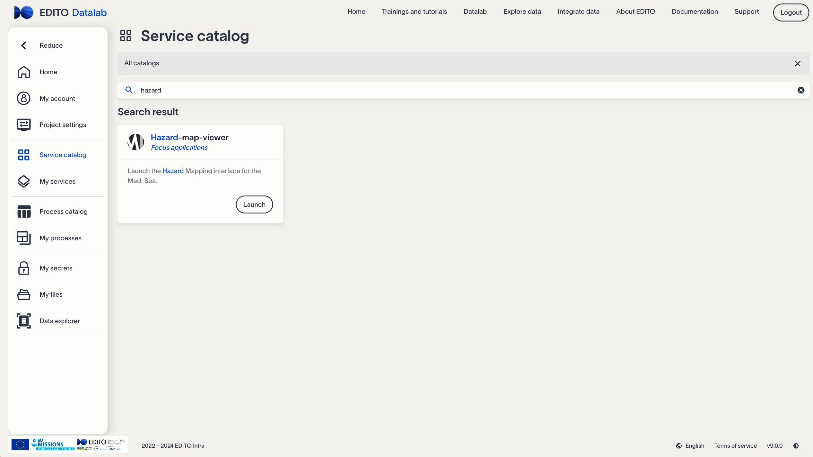

# Oil Hazard Mapping of Med Sea for Edito - Step-by-Step Guide

#### Developer: [University of Bologna](https://www.unibo.it) - Italy

## EDITO-Model Lab's Focus Applications (FAs) and What-if Scenarios (WiSs)
The European Digital Twin of the Ocean (EDITO) provides an innovative set of user-driven and interactive decision-making tools. Within this framework, EDITO-Model Lab’s Focus Applications are demonstrators of the capabilities of the next generation ocean models incorporated into the project. The Focus Applications  are delivered in the EDITO platform with high technology readiness level within three thematic areas, related to key EU policy questions: *marine biodiversity*, *greenhouse gas emissions* from maritime shipping and *marine pollution*. The FAs and WiSs are interactive virtual demonstrators hosted on the EDITO platform and they incorporate powerful technical components (such as data, software, and computational infrastructure) into a user-friendly environment. You can read the ADDED VALUE OF THE EDITO-MODEL LAB FOCUS APPLICATIONS [here](https://edito-modellab.eu/news/what-is-the-added-value-of-the-edito-model-lab-focus-applications-nbsp).

## Background of this Focus Application
The **Oil Hazard Mapping** viewer belongs to the *marine pollution* thematic area of EDITO-Model Lab. It aims to make available an online tool with a simple user interface to allow stakeholders from different background to visualize the average surface oil concentration, the average beached oil and the hazard index connected with oil spill simulations from marker points in the Mediterranean Sea. It provides the user with a support to understand, evaluate and visualize possible hazards for the coast connected with simulated oil spill releases.

## How to use it

### 1st Step - Registration
First of all, ensure that you get your access to Edito Model Lab. The link to register is: [registration Link](https://auth.lab.dive.edito.eu/auth/realms/datalab/login-actions/registration?client_id=onyxia&tab_id=v7ZzJLSVUwU)

### 2nd Step - Login
After obtaining your login, you need to log into the platform to access all internal resources. Below is a sample screenshot of the login page:

Use the following link to log in:

[Login Link](https://auth.lab.dive.edito.eu/auth/realms/datalab/protocol/openid-connect/auth?client_id=onyxia&response_type=code&scope=openid+profile&state=eef59efecf3640778f23368684114a62&code_challenge=kUlFtN1zcshm1bnQFmFeiHk950KLL72g0DedvYtsSQA&code_challenge_method=S256&response_mode=query&onyxia-instance-public-url=https%3A%2F%2Fdatalab.dive.edito.eu&ui_locales=en&redirect_uri=https%3A%2F%2Fdatalab.dive.edito.eu%2F%3Foidc-spa_config_hash%3D9dac8833%26oidc-spa_result_omit%3DWyJvaWRjLXNwYV9jb25maWdfaGFzaCJd%26oidc-spa_intent%3De30%253D)

### 3rd Step - Find & Launch the Service
After logging in, find the Hazard-map-viewer service in the service catalog. Use the following link to search for it: [Hazard mapping Search Link](https://datalab.dive.edito.eu/catalog/All?search=hazard)

Clicking on "Launch" will bring you to the next page. Simply click "Launch" again and wait (~3-5 minutes) for the service to be downloaded on the platform. This process only happens once; afterward, it will not take as long.

Once it's ready, just open the service.

### 4th Step - Using the Hazard-map-viewer service
The application will start from the following landing page:

To start using it, click on "HAZARD MAPPING RESULTS" on the left panel. 

The first action required is to select a release point location among the available ones to visualize the average surface oil concentration, the average beached oil and the hazard index. Zoom the map clicking on it or using the "+/-" buttons on the top left of the map, until you reach the desired level of detail. The number of release points in this example is purely indicative.

  

  
In case, you can prefer to visualize the geopolitical map, before operating the selection. Use the top-right menu, as in the following figure.

Then, select a point on the map by clicking one of the available markers. 
In what follows, a point on the coast of Tunisia has been used:

	*  Time interval options appear only when a specific point is selected *

### 5th Step - Visualize the Results
When a point is selected, the user can choose the output parameters (see the picture above): the visualization of the results can be set by years, by seasons or by month/s of interest. Multiple selections are allowed. When the selection by seasons or by months is used the whole set of simulations for all the available years are employed. Keep in mind that more specific is the time interval, smaller is the ensemble set of available simulations used to calculate the results.
Pressing the "Show results" button starts the procedure to visualize the available products: the average surface oil concentration, the beached oil  and the hazard index.

 

  
  
For the investigation of the hazard index it is possible to set the threshold value of the beached oil. This value is defined as the maximum oil volume the beach can actually hold. It is possible to set this value moving the slide bar placed on the top of the hazard index product. An image of this bar is visible in the following figure:

  
  
For each product it is also possible to save in local the graphical results, clicking on the relative buttons. In particular, the maps can be save in a dynamical format (.html) such that the zoom-in and zoom-out functions can be exploited, or in a static format (.png) suche that the map will appear as a "not-zoommable" image. In the following, as example, the buttons to save the files in the two different formats, for the average surface oil concentrations, are shown:

  
### 6th Step - Additional functions
To improve the users experience some additional functions have been added to the *Graphical User Interface* (GUI).
If a different palette than the default one is required for the average surface oil concentration (e.g., in case of ***color blindness***) the user can switch the toggle button and the system will recalculate the output. This functionality gives the service the character of *inclusivity*, as requested by the EU.

 

Moreover, sometimes can be useful to show a ***pin*** to highlight the release point on the products maps: it can be done using the top right subpanel, as shown in the following pictures.

## Scientific background

### 1) Aim

Oil pollution hazard mapping is conducted to manage and minimize
the effects of oil spills on coastlines in the critical first hours following a
detected release. The key question it addresses is: where is the oil likely to go,
and how quickly? To answer this, hazard mapping uses a probabilistic approach with
multi-model ensemble simulations, which account for uncertainties such as the exact
timing, location, type of oil, and variability in ocean currents. These products can be used by oil spill emergency response teams.

The ***Hazard-map-viewer*** service is containerized via Docker, simplifying computational processes and delivering ready-to-use solutions directly to end-users.

### 2) Data

The Edito-Lab **Oil Spill Hazard** mapping offers a product based on an initial
methodology developed over the years in the Atlantic basin (Sepp-Neves et al., 2017,
2021). This approach simulates oil transport and transformation from multiple
coastal release points over several years and calculates oil trajectories and
beaching events. 
The resulting ensemble of oil concentrations is used to create different hazard
maps and indices.

To perform the forecasting, the ***Hazard Mapping*** service employs the following input products:

- Marine forecasts: providing water currents speed, temperature and salinity ([Copernicus Mediterranean Sea Physics Reanalysis](https://data.marine.copernicus.eu/product/MEDSEA_MULTIYEAR_PHY_006_004/description)).

- Atmospheric forecast: providing wind speed ([ECMWF Reanalysis v5 (ERA5)](https://www.ecmwf.int/en/forecasts/dataset/ecmwf-reanalysis-v5)).

- Bathymetry: providing morphology of the sea bottom (the [GEBCO 2023 Grid](https://www.gebco.net/data_and_products/gridded_bathymetry_data/gebco_2023/)).

- Coastal profile: provding the profile of the coast that oil can eventually hit ([NOAA coastline](https://www.ngdc.noaa.gov/mgg/shorelines/)).

The forecasting model is based on the ***Medslik II*** software, internally developed by the University of Bologna. For more information and details about the equations driving the model please refer to the following peer-reviewed [publication](https://www.sciencedirect.com/science/article/pii/S0025326X14007231).

#### Essential Bibliography

[1] De Dominicis M., N. Pinardi, G. Zodiatis, R. Lardner, 2013. “MEDSLIK-II, a Lagrangian marine surface oil spill model for short-term forecasting – Part 1: Theory”. Geosci. Model Dev., 6, 1851-1869, (2013), doi:10.5194/gmd-6-1851-2013
[2] De Dominicis M., N. Pinardi, G. Zodiatis, R. Archetti, 2013. “MEDSLIK-II, a Lagrangian marine surface oil spill model for short-term forecasting – Part 2: Numerical simulations and validations”. Geosci. Model Dev., 6, 1871-1888, (2013), doi:10.5194/gmd-6-1871-2013
[3] Sepp Neves, A.A., Pinardi, N. & Martins, F. IT-OSRA: applying ensemble simulations to estimate the oil spill risk associated to operational and accidental oil spills. Ocean Dynamics 66, 939–954, (2016), https://doi.org/10.1007/s10236-016-0960-0
[4] Sepp Neves, A.A., Pinardi, N., Navarra, A., Trotta, F., A General Methodology for Beached Oil Spill Hazard, Front. Mar. Sci., 7, (2020), https://doi.org/10.3389/fmars.2020.00065

Other useful information and an exhaustive list of bibliographic references can be found on the official ***Medslik II*** [website](https://www.cmcc.it/it/models/medslik-ii).

#### 3) Hazard mapping products
Using the ensemble simulations, three products have been achieved: average surface oil concentration, the average beached oil and the hazard index. In the following sections the detailed description of the way each product has been calculated is provided.

#### 3.1) Average surface oil concentration
The average surface oil concentrations have been produced using from 73 simulations per year, one simulation each 5 days. Each simulation provides 240 timesteps such that the average surface oil concentration has been calculated summing together all the surface concentration values for all the time steps for the entire set of simulations. 
Mathematically, the average surface oil concentration (C) is given by 

where *N* is the total number of simulations and SC(i,j)(*lon*,*lat*) is the surface oil concentration at the point of coordinates (*lon*,*lat*) (respectively longitude and latitude) during the *i*-th simulation at timestep *j*.

#### 3.2) Average beached oil
The average beached oil has been produced using from 73 simulations per year, one simulation each 5 days. Each simulation provides 240 timesteps but only the last timestep has been considered to calculate the averaged beached oil. This choice comes from the hypothesis that the beached oil is supposed to not be released back into the sea.
Mathematically, the average beached oil (B) is given by 

   

where *N* is the total number of simulations and SC(i,j)(*lon*,*lat*) is the surface oil concentration at the point of coordinates (*lon*,*lat*) (respectively longitude and latitude) during the *i*-th simulation at timestep *j*.

#### 3.3) Hazard index

The hazard index *H*, when varying the simulation point, has been achieved for the segments of the coast impacted by the released oil. For all the other points it is obviously equal to zero (no oil reaching the coastal segment). 
*H* has been calculated for a minimum resolution of 150 m of the coastal segments (full resolution of the used coastline).
In [A. A. Sepp Neves, N. Pinardi, A. Navarra, F. Trotta (2020)] *H* has been defined as 

where *lon* and *lat* are respectively the longitude and the latitude of the point under investigation and the function *F* represents the Weibull cumulative distribution function for the beached oil concentration *x* for which *x* ≤ xcut. In the same paper the value of xcut is fixed to 25 tons/km , with a release amount of oil for simulation *OS* = 10.000 tons (accidental oil release), and a ratio of: 

.

Using the same ratio for a spilled amount of approximatively 20 tons, the resulting xcut is equal to 0.05 tons/km. For each coastal segment, the calculation is then being elaborated summing the total (73 simulations per year) beach concentrations *TC*=0.05(*lon*,*lat*) of the spilled oil reaching a single coastal segment with a beached concentration bigger than or equal to 0.05 tons/km, and dividing it by the total amount of the oil hitting the same segment of coast, in the same period (*TC*=0(*lon*,*lat*)). 
Mathematically:

.

where *N* is the total number of simulations, *BOi(lon,lat)* are the beached oil concentrations for each simulation *i* at the coastal segment of coordinates (*lon*,*lat*) and the pedex *num* stays to indicate the numerical calculation of *H* (to distinguish this case from the one previously formalized). 

However, the value of the threshold for the calculation of the hazard index can be set by the user, such that different results are available. Higher is the threshold value, lower is the number of coastal segments impacted by an oil mass higher than the set threshold.

###### This tutorial, together with the Hazard-map-viewer Graphical User Interface and all the needed software procedures to calculate the products made available on the EDITO platform have been created for the University of Bologna by Marco Seracini with the support of the University of Bologna and CMCC.