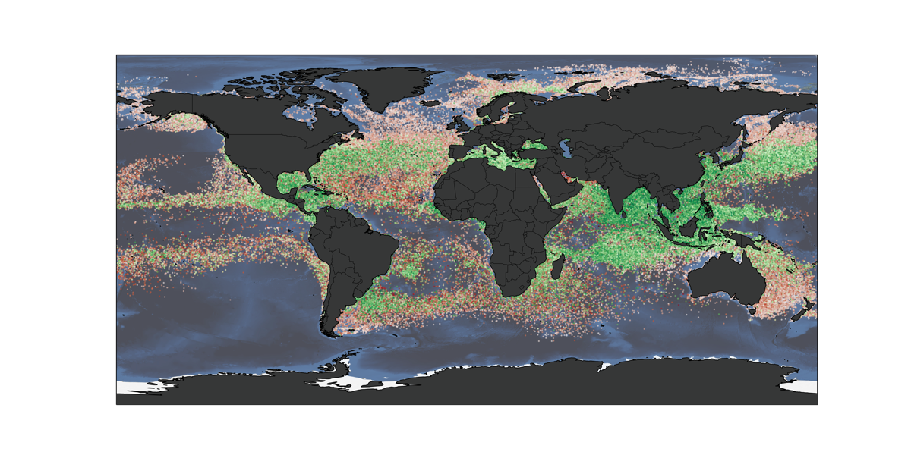
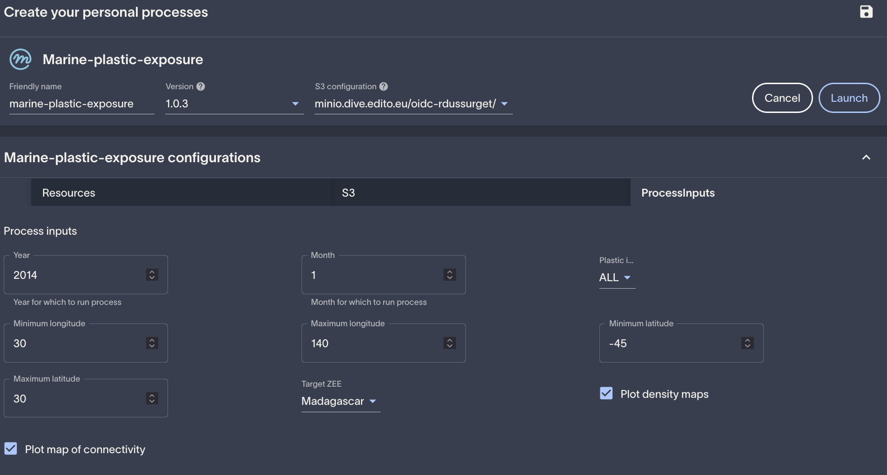
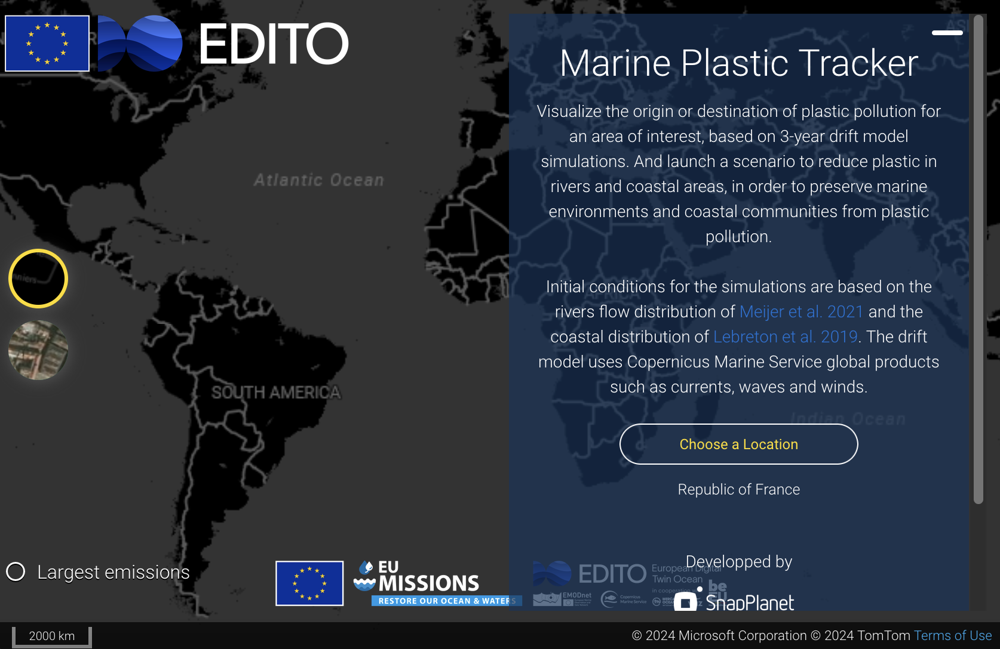
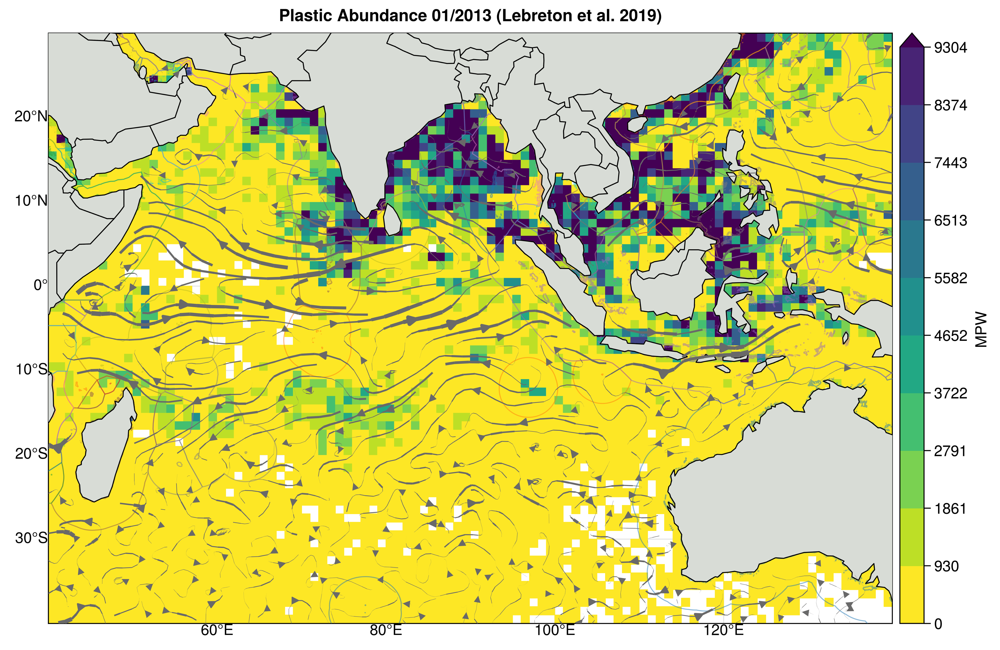
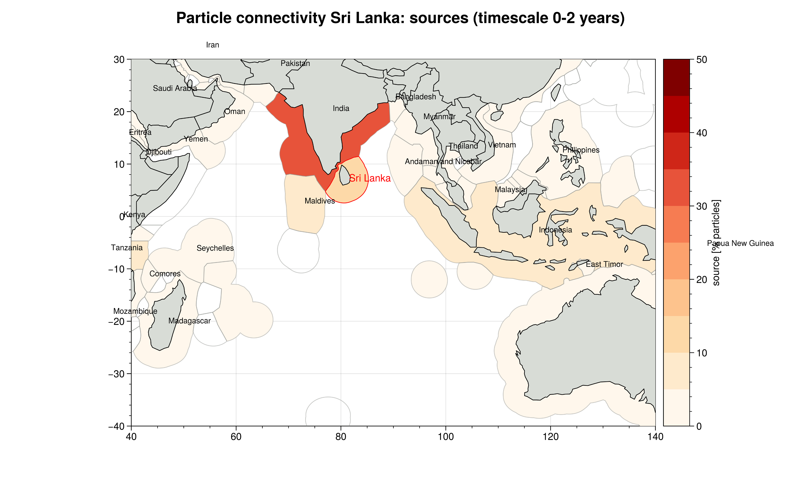
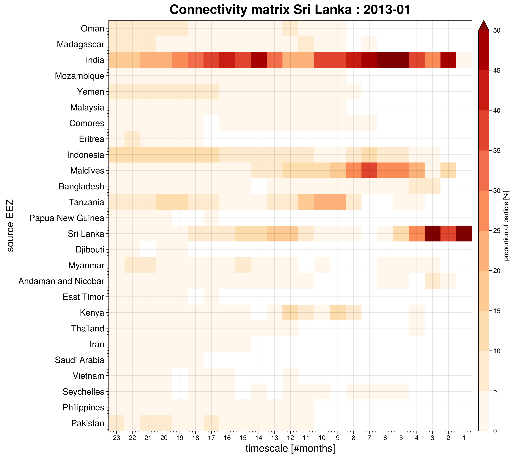

# Product description What-if Scenario

## Introduction

In EU project EDITO-Model Lab, What-if Scenario (WiS) are developed to demonstrate capability of the EDITO core model suite. Concrete and documented examples of WiS will be developed in EDITO-Model Lab and precomputed and/or on-demand datasets to address specific questions in the Ocean Mission regarding biodiversity, zero carbon and zero pollution. Consolidate datasets and interactive tools are provided to both intermediate users who may use products to develop new services and end users such as decision makers or policy makers. The WiS "Marine Plastic Exposure" is one of the EDITO-Model Lab WiSs which is addressing zero-pollution efforts.

# Exposure to Marine plastics

The tool is designed to first use plastic trajectories to assess exposure for a region of interest, we have illustrated this using EEZ
First by visualising plastic debris abundance
Determine the sources and associated timescale based on the history of the particle

And secondly, once sources and timescale identified, how the potential removal plan would impact the exposure footprint

The model treats 2 types of plastic sources:
1. Plastic entering the ocean from the coast emissions 
2. Plastic entering the ocean from riverine emissions 

## 2. Data products
Published dataset on plastic ocean emissions at global scales (continental and riverine discharges) are used to initialise plastic releases in the Lagrangian simulation (Lebreton 2017, Lebreton and Andrady 2019, Meijers et al. 2021). 
A Lagrangian particle tracking tool is used to transport virtual plastic in the marine environment using the surface velocity field of the Copernicus MArine Service Global Ocean Physics Analysis including the wave component from SMOC product (Surface merged Ocean Current).
The advantage of lagrangian simulation is that the history of positions is known and we can therefore know its origin

Marine plastic pollution what-if scenarios provide information to following three questions:
1. What is density of floating plastics for a user selected EEZ for a particular time in the historical period (2022-2019)
2. What are the potential origins and associated timescale of the modelled ocean plastics present in the area
3. What reduction scenarios (regional riverine or coastal reduction) could be effective in reducing local exposure

## 3. Service description

The Service is declined as 1 process ([Marine Plastic Exposure](https://datalab.dive.edito.eu/process-launcher/what-if-scenarios/marine-plastic-exposure)) and 1 service ([Marine Plastic Tracker](https://marine-plastic-tracker.lab.dive.edito.eu/)) in the DataLab.

1. For the [**Marine Plastic Exposure**](https://datalab.dive.edito.eu/process-launcher/what-if-scenarios/marine-plastic-exposure), select an EEZ, the period of interest and type of plastic sources.

2. For the what if scenario, use the [**Marine Plastic Tracker**](https://marine-plastic-tracker.lab.dive.edito.eu/) service.

### Scientific Background

Modelling microplastics in the marine environment involves all important processes that influence the life-span of the pollutants. In this study, the focus is set on the following two aspects:
1. Mapping and quantification of the coastal sources
2. Ocean Transport of floating plastic 

Plastic pollution has a considerable impact on the biodiversity near the coasts but also on the local economy. For such regions, knowing the distribution and the origin of such plastics, would facilitate action plans for the reduction of marine plastic. However, the plastic distribution in the ocean is poorly understood at small scales due to the scarcity of measurements and their uncertainties. 
In this study, we use several datasets to estimate the plastic released into the ocean and then simulate thei transport in the ocean using a Lagrangian Particle tracking tool. The virtual plastic particles drift from the surface currents from the Global Ocean Physics Analysis product, including ocean surface circulation and wave effects.
We use Exclusive Economic zones for the purpose of the demonstration as geographical zones used for diagnosing marine plastic exposure. The tool investigates modelled plastics in EEZs by creating density maps for user defined periods (a givenm mon th within the study period 2012-2019) and inter-EEZ connectivity matrices from the modeled trajectories. These results are based on 10 years of Lagrangian trajectory simulations for the peruiod - 2010-2020 - with weekly particle riverine and coastal discharges that have a life- time at sea of two years (characteristic scale of plastic degradation). 

An illsutration of the figures can be found for the Sri Lanka EEZ region below:

1. density of plastics

2. Connectivity map of potential origins

3. Detail of the Connectivity of Sri Lanka EEZ with other areas and associated timescales

