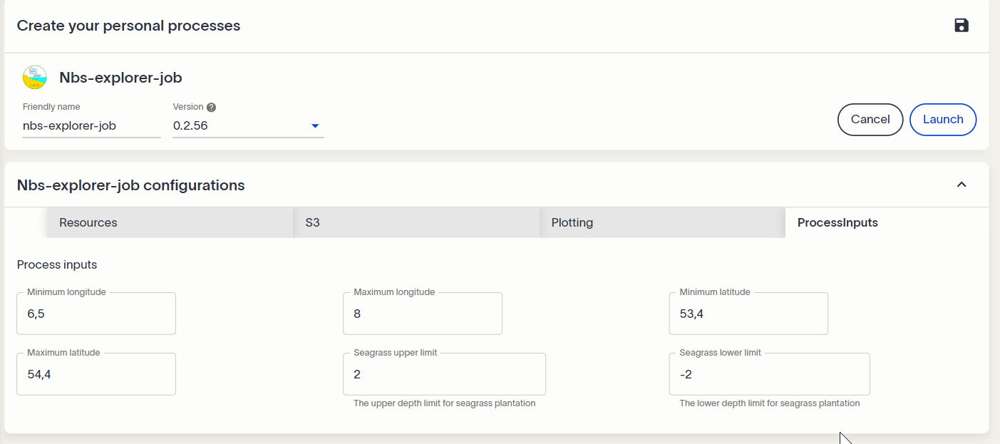
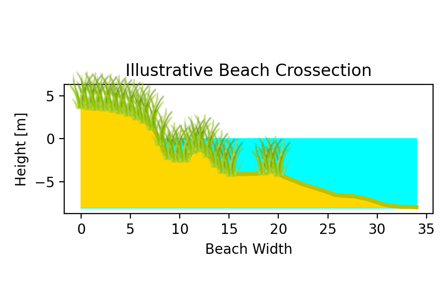
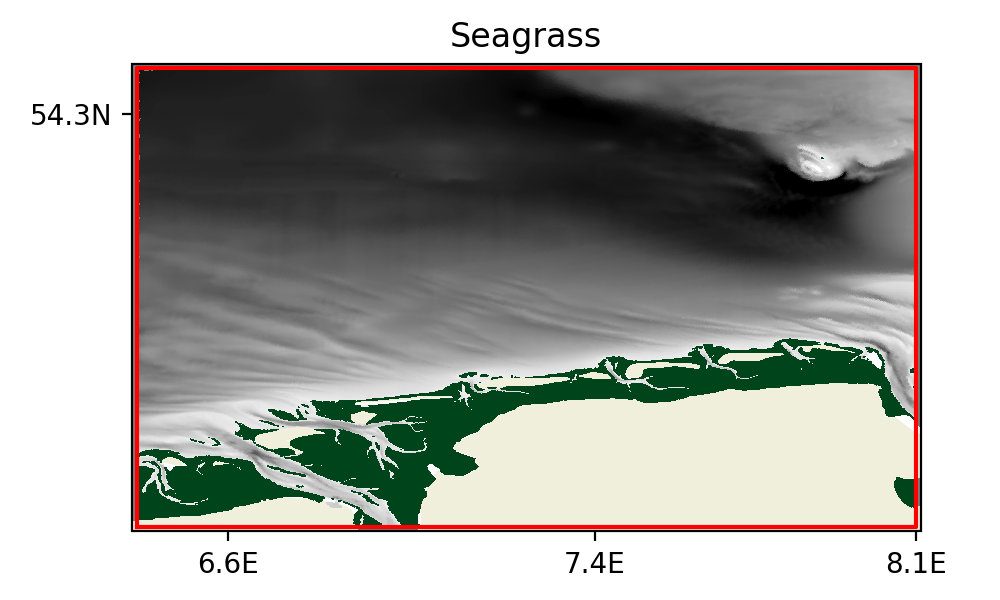
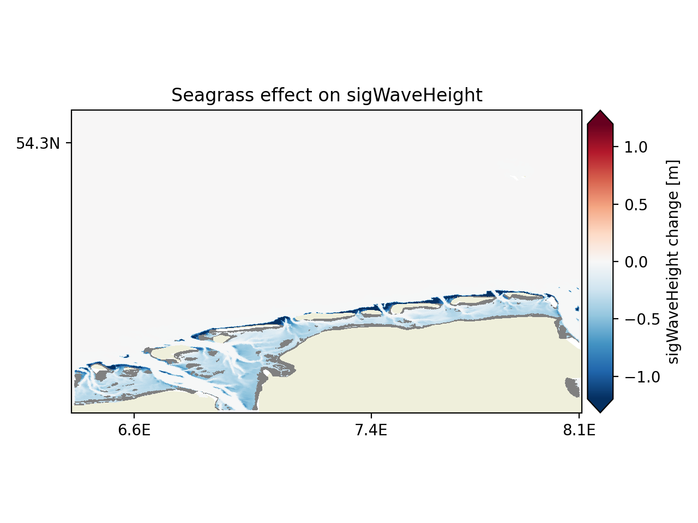
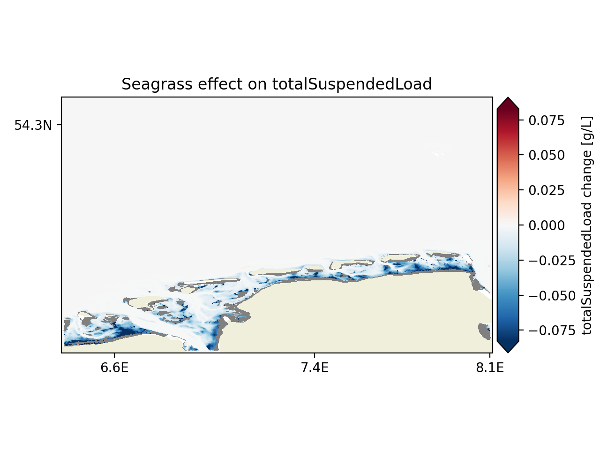
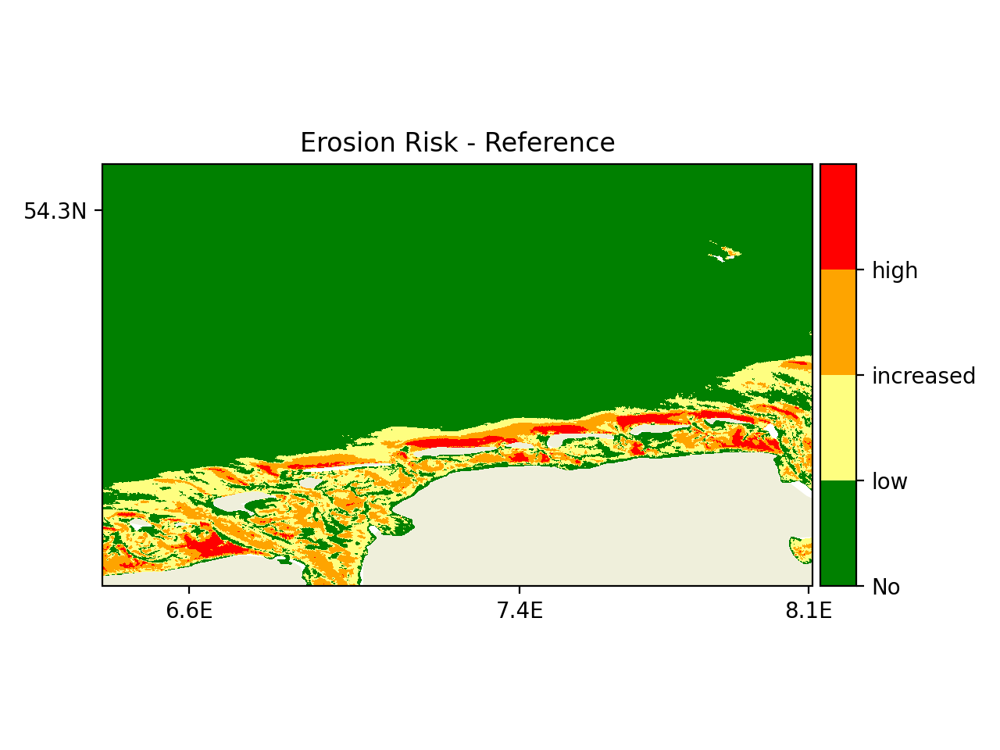
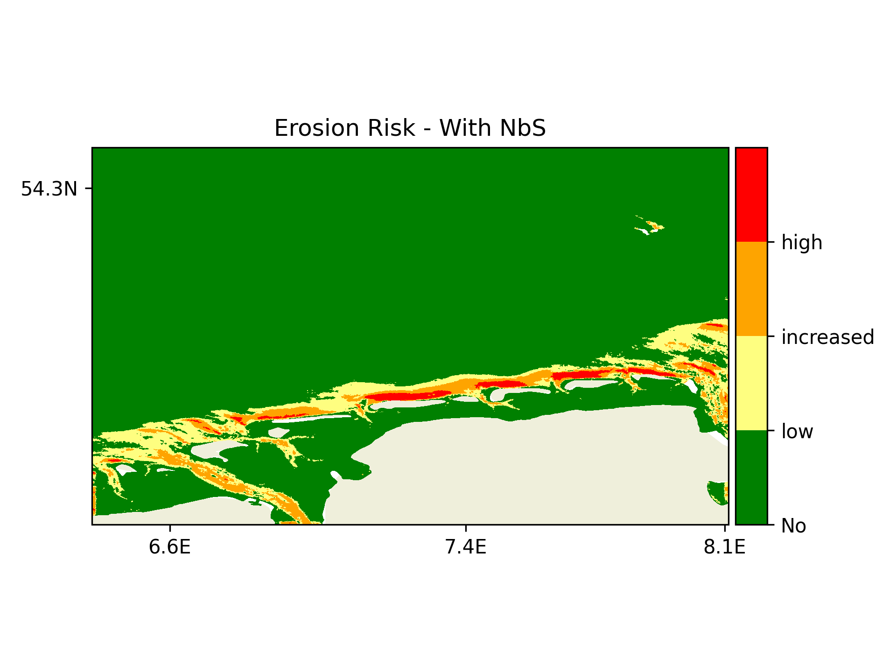
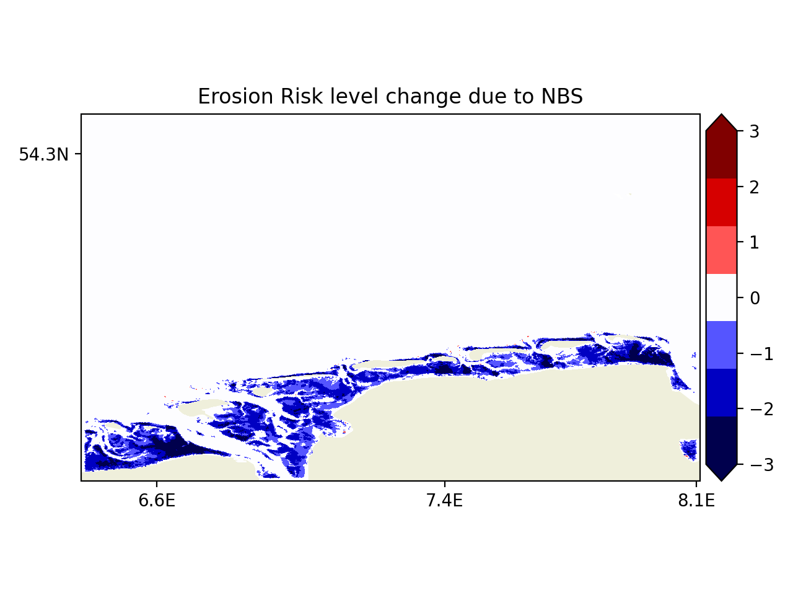
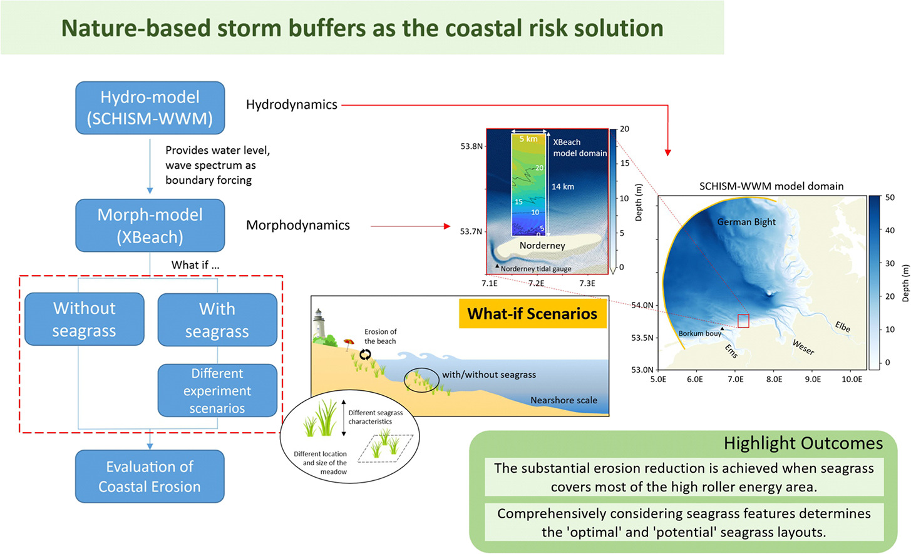

# NbS Explorer
# EDITO What-if Scenarios (WiS) for Nature based Solutions (NbS)

#### Developer: [Helmholtz-Zentrum hereon](https://www.hereon.de/index.php.en) - Helmholtz-Zentrum hereon, Germany

|  |
|  |

## EDITO-Model Lab's Focus Applications (FAs) and What-if Scenarios (WiSs)

The European Digital Twin of the Ocean (EDITO) will provide an innovative set of user-driven and interactive decision-making tools. 
Within that framework, EDITO-Model Labs Focus Applications are demonstrators of the capabilities of the next generation of ocean models that the project is building. 
We will deliver our Focus Applications with high technology readiness level within three thematic areas that are related to key EU policy questions: marine biodiversity, 
greenhouse gas emissions from maritime shipping, and marine pollution. 
You can read about the ADDED VALUE OF THE EDITO-MODEL LAB FOCUS APPLICATIONS [here](https://edito-modellab.eu/news/what-is-the-added-value-of-the-edito-model-lab-focus-applications-nbsp).

A What-if Scenario (WiS) is a hypothetical situation that is imagined to simulate the potential consequences of different choices or circumstances, 
allowing individuals or organisations to better prepare for the future. In various fields such as business, science, or engineering, WiS are often used as a tool for analysis, planning, or decision-making. 
In the context of ocean governance and coastal zone management, WiS can be extremely valuable for assessing and planning for various threats, policies, actions, projects, investments, and initiatives.
WiS applications are delivered  for the three topics:

1. WiS 1 Nature-based solutions for marine biodiversity and coastal hazards
2. WiS 2 Marine plastic for zero pollution
3. WiS 3 quaculture for zero carbon

You can read about the ADDED VALUE OF THE EDITO-MODEL LAB What-IF Scneraios [here](https://edito-modellab.eu/news/what-can-you-do-with-the-edito-model-lab-what-if-scenarios).
The FAs and WiSs are interactive virtual demonstrators hosted on the EDITO platform that incorporate powerful technical components (such as data, software, and computational infrastructure) 
into a user-friendly environment. 

## Background of this What-if Scenario - WiS 1 Nature-based solutions for marine biodiversity and coastal hazards

### Nature based solutions for coastal erosion protection

Nature-based solutions for coastal protection are strategies that utilize natural ecosystems to protect coastal environments from erosion, flooding, 
and other environmental challenges. These solutions include restoring and conserving wetlands, mangroves, coral reefs, and dunes, 
which act as natural barriers, reducing wave energy and stabilizing shorelines. 
Nature-based solutions provide sustainable, cost-effective, and resilient alternatives or additions to traditional engineered coastal defense strategies. 
Further they offer additional benefits such as habitat creation, carbon sequestration, and improved water quality.

### Purpose and target users

This WiS application is aimed to serve as a powerful tool for decision-making in planning nature-based coastal protection strategies at the example of intertidal seagrass. 
It provides insights on how a specific NbS layout affects coastal ocean dynamics and erosion risks. 
It enables users to investigate different seagrass configurations to identify the optimal layout for the reduction of erosion risks. 

This application is designed for end-users involved in or interested in coastal zone management and protection, policymakers, and scientists. 
No specialized technical or computational skills are required to execute the process or interpret the results, 
beyond basic familiarity with navigating the EDITO platform and launching processes. 
These steps will also be briefly explained in the [Workflow of the What-if Scenario](#workflow-of-the-what-if-scenario).
The results, as presented in the following section, include intuitive, color-coded risk reduction maps and maps showing changes in various hydrodynamic and morphodynamic variables. 
While a general understanding of coastal ocean dynamics can enhance the interpretation of these outputs, it is not essential for a conceptual understanding.

More background information and a video illustrating the general idea can be found
in the EDITO news article [here](https://edito-modellab.eu/news/how-can-you-optimise-seagrass-meadows-as-a-nature-based-solution-for-coastal-hazards-nbsp), further 
information on the scientific background can be found on the [end of this document](#scientific-background)

You can launch a correspondig process on EDITO [here](https://datalab.dive.edito.eu/launcher/process-playground/nbs-explorer-job?version=0.2.13).
The showcase is launched for a customizable sub-area of the German Bight, utilizing simulations based on present-day climate conditions for October 2017, which include the storm event Herwart.

## Workflow of the What-if Scenario

A subdomain can be selected using the input mask for the minimum and maximum values of longitude and latitude. 
The seagrass extent in the intertidal, supralittoral, and infralittoral zones is configured via settings for the Seagrass Upper Depth Limit (the maximum depth at which seagrass will be introduced) and the Seagrass Lower Depth Limit (the shallowest depth on top of the beach where seagrass is found). 
Seagrass will be introduced between these limits.

Depending on the beach slope, the same interval between the upper and lower depth limits can result in different horizontal areal coverage. 
A steeper slope results in a smaller horizontal extent, while a gentler slope results in a larger horizontal extent.
These values are set with respect to the still water level (=0), with negative values indicating depths below water (infralittoral) if they are greater than the tidal amplitude.

In our example, we will reintroduce seagrass in the East Frisian Wadden in the German Bight, where the tidal amplitude is about 2 meters. 
Considering the lower supralittoral zone flooded during spring tides and the strong currents in tidal channels starting at a depth of about -4 meters, 
which are unsuitable for seagrass, we will reintroduce seagrass in the depth interval from -4 to 4 meters. 
This establishes the uppermost theoretical possible restoration scenario for seagrass in this region.
This corresponds to the following configuration (Figure 1)

|  |
|:--:| 
| Fig. 1: Screenshot of input configuration for NbS process|

After clicking the Launch button, the execution of the process will take about 10 minutes to complete.
Once finished, the results will become available in "My Files" inside a subfolder corresponding  to the process name.

##  Example output and guiding explainations

The results contain different informational images that are bundled within a pdf file and encompass the following information:

### Seagrass Coverage

The seagrass coverage resulting from the specified depth range is sketched for an illustrative beach profile to give an idea about the vertical extent occupied by seagrass.

|  |
|:--:| 
| Fig. 2: Conceptual illustration of seagrass plantation along a beach crossection corresponding to a plantation between a depth of 4 and -4 m with respect to still water level|

The resulting seagrass coverage in the horizonal depends on the underlying bathymetry and for the user defined vertical extend range is displayed on a map
The presence of seagrass is indicated by the green color overlayed on a  plot of the coastal bathymetry structure (Fig. 3).
As intended, we receive a seagrass coverage (green) for the entire back barrier wadden sea except for the deep channels, were seagrass would not be able to persist.

|  |
|:--:| 
| Fig. 3: Map of seagrass coverage in the model configuration on top of the bathymetry |

## Results - Impact of Seagrass on coastal hydrodynamics and erosion risk

It is expected that at least locally seagrass attenuates waves and currents and hence the resulting
stresses attacking at the seafloor and coast should be reduced. These in turn then leads to reduction
in sediment mobilization and conditions favoring the sinking of sediments.

The Results are based off a comparison between two simulations, the one which we have configured and reference scenario without any seagrass.
The attenuation is demonstrated for selected hydrodynamic variables and in term of a risk metric:

i. Significant Wave Height (Represents the average height of the highest third of waves.)
ii. Bottom layer sediment concentration (represents the concentration near the seafloor, high values are indicative of mobilization of particles by erosive forces)
iii. Erosion risks derived from bottom stress (bottom stress is the tangential force at the seafloor that leads the erosion of sediments if it surpasses a critical value depending on the type of sediment)

### Hydrodynamic Results

The results for the hydrodynamic changes due to seagrass are illustrated as differences in the 95th percentiles, 
for our configured restoration scenario minus a reference scenario without seagrass.

Figure 4 demonstrates that wave heights are indeed reduced (predominantly blue) by a few centimeters, 
which corresponds to more than a 40% reduction for this region. 
This reduction indicates a decreased flooding risk from wave overtopping on top of the surge component and 
a reduction in wave-induced stresses toward the coast, which contributes to erosion.

The erosion reduction is indicated by the 95th quantile of bottom layer sediment concentration. 
The figure shows a decrease, indicating that less bed material is eroded into the water column. 
Reductions reach up to 2 g/L, and commonly exceed 80%-90%, almost completely protecting the bottom from erosion.

|  |
|:--:| 
| Fig. 4: Map of reduction in significant wave height in response to seagrass restoration, given as the difference in the 95th percentile between the scenario and the seagrass-less reference run.  |

The erosion reduction is shown here by proxy in terms of the 95th quantile of bottom layer sediment concentration (Fig. 5). 
We can again observe a reduction, indicating that less bed material is eroded into the water column. 
Reductions reach up to about 1 g/L, and on a wide scale, exceed 80%-90%, almost completely protecting the bottom from erosion.

|  |
|:--:| 
| Fig. 5: Map of erosion reduction proxied by sediment concentration in response to seagrass restoration, given as the difference in the 95th percentile between the scenario and the seagrass-less reference run.  |

### Erosion risk reduction

Based on the reduction in shear stress and knowledge about the sediment composition in the area, a erosion risk indicator is created based on the relative amount of time erosion could take place in the different areas.
As part of the results the erosion risk is presented for the reference case without seagrass (Fig. 6)
 
|  |
|:--:| 
| Fig. 5: Map of erosion risk estimate for the seagrass-less reference run. 

and analogously for our seagrass recovery scenario (Fig. 7)

|  |
|:--:| 
| Fig. 7: Map of erosion risk estimate for the seagrass scenario run. 

Clearly in the wadden sea area where seagrass was introduced, the erosion risk is reduced.
The risk level reductions is further depicted in another map given the difference between the to risk maps as levels.

|  |
|:--:| 
| Fig. 8: Map of erosion risk reduction for  scenario run compared to the seagrass-less reference run. 

## Scientific background

The showcased what-if scenario application is based on the scientific works of [Jacob et al. 2023](https://www.sciencedirect.com/science/article/pii/S0048969724023908)
and [Chen et al. 2024](https://link.springer.com/article/10.1007/s10236-023-01577-5),  which explored the potential role of seagrass in coastal protection. 
This research acknowledges the growing need for effective coastal defense strategies in response to global sea level rise, which significantly increases the risk of coastal erosion and flooding.
In recent decades, nature-based solutions (NbS) have gained prominence as a viable complement to traditional ("grey") infrastructure, 
such as dikes, groynes, breakwaters, and sea walls. NbS offers a sustainable and adaptive approach that, in some cases,  can supplement or even replace conventional engineering methods, enhancing resilience while leveraging the benefits of natural ecosystems.

### Capabilities of Seagrass as Nature based Solution

Seagrass interacts with the marine environment and provides several benefits:

* Seagrass shoots and leaves dissipate wave energy, promote wave breaking, and reduce currents
* Seagrass roots stabilize the seabed, reduce erosion, and enhance sediment deposition
* Seagrass helps mitigate global warming by acting as a carbon sink.
* Seagrass meadows provide habitats, food sources, and nursery grounds for marine life.

### Methodology 

The interactions between seagrass and the coastal marine environment are simulated
with high resolution coastal modeling systems that simulate hydrodynamic, wave and sediment dynamics
accounting for the effects of vegetation on waves, currents and turbulence.
The modeling system has been set up coupling the the Hydrodynamic model SCHISM with wave model WWM
and the 3D sediment model SED3D as well as a subnested Xbeach model system for the simulation of beach eroison.

Using this modeling system, scenario simulations  are conducted for a reference case without any coastal vegetation to set the baseline,
and scenarios with different seagrass coverage configurations.

|  |
|:--:| 
| Fig. 9: Illustration of the What-if Scenario modeling workflow. 

The reference case and the seagrass expansion scenario simulations are conducted for October, 2017
containing storm Herwart.  The results on simulated wave and current dynamics are subjected to statistical analyses to determine the
effects of seagrass expansion on hydrodynamics. The analyses are presented in terms of changes in the 95th percentile for different 
hydrodynamic variables. These values indicate the seagrassÂs hydrodynamic engineering capacities under extreme conditions
as depicted for the results presented for the [Example output and guiding explainations](#example-output-and-guiding-explainations).
More in depth explanations can be found in the underlying scentific literature. [Jacob et al. 2023](https://www.sciencedirect.com/science/article/pii/S0048969724023908)
and [Chen et al. 2024](https://link.springer.com/article/10.1007/s10236-023-01577-5)
