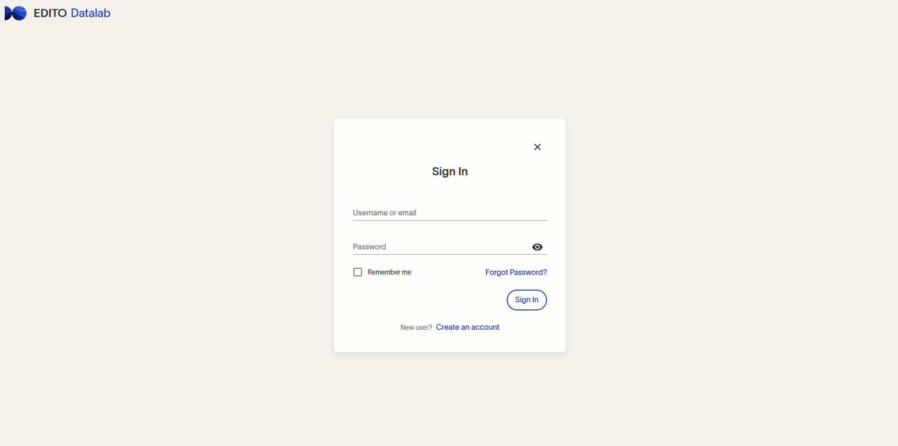

<table style="border-collapse: collapse;">
  <tr>
    <td style="padding:0; margin: 0; border: 0;">
      
    </td>
  </tr>
</table>

# WITOIL-Cloud for EDITO

#### Developer: [CMCC Foundation](https://www.cmcc.it) - Euro-Mediterranean Center on Climate Change, Italy
#### This service has been developed as part of EDITO-Model Lab

## EDITO-Model Lab's Focus Applications (FAs) and What-if Scenarios (WiSs)
The European Digital Twin of the Ocean (EDITO) will provide an innovative set of user-driven and interactive decision-making tools. Within that framework, EDITO-Model Lab’s Focus Applications are demonstrators of the capabilities of the next generation of ocean models that the project is building. We will deliver our Focus Applications with high technology readiness level within three thematic areas that are related to key EU policy questions: marine biodiversity, greenhouse gas emissions from maritime shipping, and marine pollution. The FAs and WiSs are interactive virtual demonstrators hosted on the EDITO platform that incorporate powerful technical components (such as data, software, and computational infrastructure) into a user-friendly environment. You can read the ADDED VALUE OF THE EDITO-MODEL LAB FOCUS APPLICATIONS [here](https://edito-modellab.eu/news/what-is-the-added-value-of-the-edito-model-lab-focus-applications-nbsp).

## Background of this Focus Application
The WITOIL-Cloud application provides a critical decision support system (DSS) for managing emergencies during oil spill incidents. By integrating environmental monitoring, state-of-the-art modeling, and innovative web-based technology, WITOIL enables stakeholders to respond effectively to oil spills.

Central to WITOIL (Where Is The Oil) is the MEDSLIK-II Lagrangian oil spill model, which incorporates operational oceanographic services at basin and regional scales. The system also features modules for oil spill forecasting and uncertainty evaluation, ensuring robust and reliable predictions for emergency management.

WITOIL-Cloud provides an online system with an intuitive user interface, allowing stakeholders from diverse backgrounds to easily launch oil spill simulations for nearly any maritime area, whether in the present or the past. This feature enables users to better understand and visualize potential outcomes of oil spill incidents.

## Workflow of this Focus Application

This on-demand tool provides access to the WITOIL-Cloud platform, enabling users to visualize and analyze oil spill scenarios in maritime areas worldwide. The schema below summarizes the workflow.

To start the service, follow [this link](https://datalab.dive.edito.eu/) to create an account. Then, go to the Service catalog and search for [WITOIL-Cloud](https://datalab.dive.edito.eu/catalog/All?search=witoil) and click on "Launch". Once the application is up and running, go to the "WITOIL SIMULATION" page, fill in the fields with your CMEMS and ECMWF registrations and set up your simulation. Click the "Launch" button, wait for the simulation to finish, and then explore the results on the "RESULTS" tab in the left panel.

## Detailed Workflow

### 1st Step - Registration
First of all, ensure that you get your access to Edito Model Lab. Go to [this link](https://datalab.dive.edito.eu/) and click on "Create an account".

### 2nd Step - Login
After obtaining your login, you need to [log into the platform](https://auth.lab.dive.edito.eu/auth/realms/datalab/protocol/openid-connect/auth?client_id=onyxia&response_type=code&scope=openid+profile&state=eef59efecf3640778f23368684114a62&code_challenge=kUlFtN1zcshm1bnQFmFeiHk950KLL72g0DedvYtsSQA&code_challenge_method=S256&response_mode=query&onyxia-instance-public-url=https%3A%2F%2Fdatalab.dive.edito.eu&ui_locales=en&redirect_uri=https%3A%2F%2Fdatalab.dive.edito.eu%2F%3Foidc-spa_config_hash%3D9dac8833%26oidc-spa_result_omit%3DWyJvaWRjLXNwYV9jb25maWdfaGFzaCJd%26oidc-spa_intent%3De30%253D) to access all internal resources. 

### 3rd Step - Find & Launch the Service
After logging in, go to the Service Catalog and search for [WITOIL-Cloud](https://datalab.dive.edito.eu/catalog/All?search=witoil). 

Clicking on "Launch" will bring you to the next page. Simply click "Launch" again and wait (~3-5 minutes) for the image to download. This process only happens once; afterward, it will not take as long.

Once it's ready, just open the service.

### 4th Step - Using WITOIL-CLOUD
The application will start from the following landing page:

To start using it, click on "WITOIL SIMULATION" on the left panel. 

The first action required is to select a point source location to perform an oil spill simulation. Select a point on the map by clicking anywhere (with water). For example, here’s a point on the coast of Portugal:

Scroll down to modify the oil spill characteristics as desired.

### 5th Step - Register within CMEMS
For the following two fields, a Copernicus username and password are required:

If you don’t already have an account, register [here](https://data.marine.copernicus.eu/register?redirect=%2Fproducts).

With your login details, fill in the username and password fields.

### 6th Step - Register and Accept Terms within the Climate Data Store from ECMWF
The next field requires a token from each user to access ERA5 reanalysis data from ECMWF.

To create an account, click [here](https://accounts.ecmwf.int/auth/realms/ecmwf/protocol/openid-connect/auth?client_id=cds&scope=openid%20email&response_type=code&redirect_uri=https%3A%2F%2Fcds.climate.copernicus.eu%2Fapi%2Fauth%2Fcallback%2Fkeycloak&state=LnmYV9xerVidknPojo3UgHrUPSxQzlbc6x8GMlNWQis&code_challenge=KvF-CRFr9d7MJM4TMUq3sQOvBQZYIie4bB6dLJsSbtQ&code_challenge_method=S256).

After registration, go to your user profile to retrieve your token:

[Profile Link](https://cds.climate.copernicus.eu/profile)

The token will be located as shown in the image below:

Next, you need to accept the terms of usage for the dataset. Navigate to [ERA5 single layer data](https://cds.climate.copernicus.eu/datasets/reanalysis-era5-pressure-levels?tab=download).

Scroll down to the terms of usage section and accept them.

### 7th Step - Launch Simulation and Navigate in Results Page
Once everything is set, click the "Launch" button, wait for the simulation to finish, and then check the results on the "RESULTS" tab in the left panel.

## Scientific Background

### 1. Importance of Oil Spill Simulation and Forecasting

Oil spills pose substantial environmental, economic, and social risks, particularly in marine environments where sensitive ecosystems and coastal economies are highly vulnerable. Accurate forecasting and simulation of oil spills are critical to mitigating these impacts by enabling timely responses to contain and reduce potential damage. Modern tools for simulation and prediction play a crucial role in shaping proactive response strategies, supporting resource allocation, and informing cleanup operations (Liubartseva et al., 2021).

Operational forecasting systems integrate data from oceanographic and meteorological models to provide predictions on the transport and fate of oil. Such systems have proven indispensable during incidents like the Syrian Baniyas power plant spill in 2021 (Keramea et al., 2023) and hypothetical scenarios modeled at the Port of Taranto (Liubartseva et al.,2021). Both deterministic and stochastic modeling approaches offer insights into oil behavior under variable conditions, guiding emergency responses and environmental protection strategies.

*Source: National Oceanic and Atmospheric Administration (NOAA).*

### 2. Predicting Oil Transport and Fate

Understanding the transport and transformation of oil in marine environments involves modeling complex processes:

 - Transport Dynamics: The trajectory of an oil spill is influenced by surface currents, wind, and wave action. Studies reveal that oil drift is often guided by prevailing currents and sub-mesoscale circulation patterns (Liubartseva et al.,2021). These dynamics are critical in determining the likelihood of oil reaching sensitive areas.
 - Weathering Processes: Oil undergoes physical, chemical, and biological changes, such as evaporation, emulsification, and biodegradation (Keramea et al., 2021; Zodiatis et al., 2021). These processes alter its properties, influencing the effectiveness of cleanup efforts and environmental recovery.
 - Interaction with the Environment: Oil can interact with water and sediment, forming tarballs or sinking under certain conditions (Hua et al., 2018). These interactions complicate response strategies and necessitate accurate simulations for effective management.

 

 *Source: Keramea, 2021.*

### 3. Addressing Uncertainty in Oil Spill Modeling

Predicting the behavior of oil spills involves inherent uncertainties due to data gaps, variability in environmental conditions, and limitations in modeling approaches. Key sources of uncertainty include:

 - Initial Conditions: The exact location, volume, and properties of the spilled oil can be difficult to determine, impacting simulation accuracy.
 - Environmental Variability: Oceanographic and meteorological conditions, such as currents and wind patterns, are dynamic and may vary significantly over time (Keramea et al., 2021).
 - Model Sensitivity: Differences in the numerical schemes, parameterizations, and assumptions used by models can lead to varying results.

These uncertainties should be considered when interpreting the results of oil spill simulations.

 ### 4. Modeling Framework and Technological Integration

 The WITOIL system utilizes the MEDSLIK-II Lagrangian model, which simulates the transport and fate of oil spills in marine environments (De Dominicis et al., 2013). The model integrates data from operational oceanographic services and weather forecasts, enabling accurate simulations of:

 - Oil spill trajectories.
 - Concentration fields and potential coastal impact.
 - Seasonal and spatial variability in spill dynamics.

In addition to modeling capabilities, WITOIL-Cloud provides an online system with an intuitive user interface. This platform allows stakeholders, regardless of technical background, to launch simulations for nearly any maritime area in the present or past, making oil spill forecasting accessible and actionable.

### 5. Practical Applications of Oil Spill Simulations

The scientific and operational insights provided by WITOIL support a wide range of applications:

 - Emergency Response: Rapidly simulating oil spill scenarios to prioritize areas for containment and cleanup efforts.
 - Environmental Management: Assessing long-term impacts of oil spills and planning mitigation strategies to protect sensitive ecosystems.
 - Policy and Regulation: Informing guidelines and preparedness plans to reduce the risk of oil spill incidents and enhance response capabilities.
 - Stakeholder Engagement: Empowering diverse user groups, from maritime authorities to conservationists, to utilize simulation outputs in their decision-making processes.

By advancing oil spill modeling technologies and addressing uncertainties, WITOIL contributes to safeguarding marine environments and supporting sustainable maritime activities.

## References

 - De Dominicis, M., Pinardi, N. A. D. I. A., Zodiatis, G., & Lardner, R. J. G. M. D. (2013). MEDSLIK-II, a Lagrangian marine surface oil spill model for short-term forecasting–Part 1: Theory. Geoscientific Model Development, 6(6), 1851-1869.

 - Hua, Y., Mirnaghi, F. S., Yang, Z., Hollebone, B. P., & Brown, C. E. (2018). Effect of evaporative weathering and oil-sediment interactions on the fate and behavior of diluted bitumen in marine environments. Part 1. Spill-related properties, oil buoyancy, and oil-particulate aggregates characterization. Chemosphere, 191, 1038-1047.

 - Keramea, P., Spanoudaki, K., Zodiatis, G., Gikas, G., & Sylaios, G. (2021). Oil spill modeling: A critical review on current trends, perspectives, and challenges. Journal of marine science and engineering, 9(2), 181.

 - Keramea, Panagiota, Nikolaos Kokkos, George Zodiatis, Georgios Sylaios, Giovanni Coppini, Juan Peña, Pablo Benjumeda et al. "Satellite imagery in evaluating oil spill modelling scenarios for the Syrian oil spill crisis, summer 2021." Frontiers in Marine Science 10 (2023): 1264261.

 - Liubartseva, S., Federico, I., Coppini, G., & Lecci, R. (2021). Stochastic oil spill modeling for environmental protection at the Port of Taranto (southern Italy). Marine Pollution Bulletin, 171, 112744.

 - Spaulding, M. L. (2017). State of the art review and future directions in oil spill modeling. Marine pollution bulletin, 115(1-2), 7-19.

 - Zodiatis, G., Lardner, R., Spanoudaki, K., Sofianos, S., Radhakrishnan, H., Coppini, G., ... & Drago, A. (2021). Operational oil spill modelling assessments. In Marine hydrocarbon spill assessments (pp. 145-197). Elsevier.

