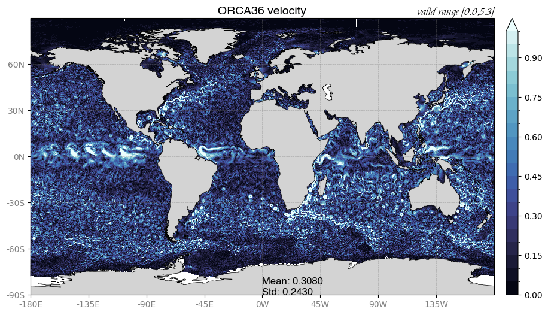

# Tutorials for analyse of NEMO global 1/36° (ORCA36) model outputs

## ORCA36 dataset on EDITO cloud

Hourly surface fields are available on EDITO cloud for a period of 3 years (2016-2018) for the Sea Surface Tempature, heigh and horizontal velocities.

Path: ``https://s3.waw3-1.cloudferro.com/ORCA36/``

## Tutorials descriptions

### Tutorial 1 (python)

In [tutorial 1](tuto1_plotORCA36.ipynb) we read a field with xarray and we plot the map with matplotlib.

## ORCA36 model configuration

ORCA36 is a new very-high resolution global configuration with a horizontal resolution of 1/36° (2 to 3 kilometers). ORCA36 uses the quasi-isotropic ORCA grid (Madec and Imbard, 1996) and has 12960 x 10842 points for the horizontal grid. Vertical discretization uses 75 z levels with partial cell parameterization (Barnier al., 2006) which leads to a resolution ranging from 1 m at the surface to 450 m at depth. The bathymetry is based on the GEBCO 2019 Grid (GEBCO, 2019) to build the global ocean bathymetry and Bedmachine Antarctica 2 (Morlighem et al., 2019) has been used to build the Antarctic cavities bathymetry and ice caps geometry. GSHHG (Wessel and Smith, 1996) data are used to build the coastline. 
The atmosphere used to force the ocean model is the ECMWF/IFS real time system. The last version of IFS has been used to force our configuration, with a resolution of 9 km and a 1-hour frequency. For the initial conditions, we used temperature, salinity, horizontal velocities and sea ice daily averages from the CMEMS GLO12V4 system implemented by Mercator Ocean International (Lellouche et al, 2018). 

## The ORCA36 model physical and numerical settings 

The present global 1/36° configuration uses a non-linear free surface (z∗ coordinates system) associated to the Quasi-eulerian Coordinates (QCO see above for HPC performances).  

Tracers’ transport is computed with a 4th order FCT advection scheme on horizontal and vertical and an explicit diffusion with iso-neutral operator. The equation of state is based on EOS80. Momentum is computed with a 3rd order UBS advections scheme and there is no explicit viscosity. Vorticity is computed with an energy and enstrophy scheme. The hydrostatic pressure gradient is computed with a s-coordinate standard jacobian formulation. 

For vertical physics, we used the GLS scheme and an adaptive-implicit vertical advection (Shchepetkin 2015).  For the boundary conditions, we used partial slip for the lateral friction and a logarithmic top (under ice cavities)/bottom drag coefficient. 

Surface fluxes are computed with the ECMWF bulk formulation. Atmospheric pressure gradient is added in ocean and ice equations. A 3 bands scheme (RGB scheme) is used for light penetration. 

For the tidal forcing, we used the tidal potential, with 5 components: O1, K1, M2, S2 and N2 and a Self Attraction and Loading term coming from FES2014 tidal atlas (see Madec, 2019, section 6.8).  

The Sea Ice model is the SI3 model shipped with NEMO, with 5 categories and levitating sea ice.

More details are available [here](https://doi.org/10.5281/zenodo.10788013) : 

Bricaud, C. (2024). Tides representation in eddy permitting, eddy rich and sub-mesocale permitting global configurations based on NEMO OGCM. Zenodo. https://doi.org/10.5281/zenodo.10788013

## References

Barnier, B., Madec, G., Penduff, T., Molines, J.-M., Treguier, A.-M., Sommer, J. L., Beckmann, A., Biastoch, A., Boning, C., Dengg, J., Derval, C., Durand, E., Gulev, S., Remy, E., Talandier, C., Theetten, S., Maltrud, M., McClean, J., and Cuevas, B. D.: Impact of partial steps and momentum advection schemes in a global ocean circulation model at eddy-permitting resolution, Ocean Dynam., 56, 543–567, https://doi.org/10.1007/s10236-006-0082-1, 2006. 

Bricaud, C., Le Sommer, J., Madec, G., Calone, C., Deshayes, J., Ethe, C., Chanut, J., and Levy, M.: Multi-grid algorithm for passive tracer transport in the NEMO ocean circulation model: a case study with the NEMO OGCM (version 3.6), Geosci. Model Dev., 13, 5465–5483, https://doi.org/10.5194/gmd-13-5465-2020, 2020. 

Egbert, G., Ray, R. Significant dissipation of tidal energy in the deep ocean inferred from satellite altimeter data. Nature 405, 775–778 (2000). https://doi.org/10.1038/35015531 

GEBCO Bathymetric Compilation Group 2019 (2019). The GEBCO_2019 Grid - a continuous terrain model of the global oceans and land. British Oceanographic Data Centre, National Oceanography Centre, NERC, UK. doi:10.5285/836f016a-33be-6ddc-e053-6c86abc0788e 

Robert Hallberg, Using a resolution function to regulate parameterizations of oceanic mesoscale eddy effects, Ocean Modelling, Volume 72, 2013, Pages 92-103, ISSN 1463-5003, https://doi.org/10.1016/j.ocemod.2013.08.007. 

Hernandez, F., Blockley, E., Brassington, G. B., Davidson, F., Divakaran, P., Drévillon, M., … Zhang, A. (2015). Recent progress in performance evaluations and near real-time assessment of operational ocean products. Journal of Operational Oceanography, 8(sup2), s221–s238. https://doi.org/10.1080/1755876X.2015.1050282 

F. Hernandez and G. Smith. GODAE OceanView Intercomparison and Validation Task Team in the context of OceanPredict : status and future activities. Version v20190408. https://oceanpredict.org/docs/Documents/Task%20Teams/IV-TT/Documents/GOV-IVTT-Statement-v20190408.pdf, 2019. 

Lellouche, J.-M., Greiner, E., Le Galloudec, O., Garric, G., Regnier, C., Drevillon, M., Benkiran, M., Testut, C.-E., Bourdalle-Badie, R., Gasparin, F., Hernandez, O., Levier, B., Drillet, Y., Remy, E., and Le Traon, P.-Y.: Recent updates to the Copernicus Marine Service global ocean monitoring and forecasting real-time 1∕12° high-resolution system, Ocean Sci., 14, 1093–1126, https://doi.org/10.5194/os-14-1093-2018, 2018. 

Madec, G. and Imbard, M.: A global ocean mesh to over-come the North Pole singularity, Clim. Dynam., 12, 381–388, https://doi.org/10.1007/BF00211684, 1996. 

Madec Gurvan, Romain Bourdallé-Badie, Jérôme Chanut, Emanuela Clementi, Andrew Coward, Christian Ethé, Doroteaciro Iovino, Dan Lea, Claire Lévy, Tomas Lovato, Nicolas Martin, Sébastien Masson, Silvia Mocavero, Clément Rousset, Dave Storkey, Martin Vancoppenolle, Simon Müeller, George Nurser, Mike Bell, & Guillaume Samson. (2019). NEMO ocean engine. In Notes du Pôle de modélisation de l'Institut Pierre-Simon Laplace (IPSL) (v4.0, Number 27). Zenodo. https://doi.org/10.5281/zenodo.3878122 

Morlighem, M., Rignot, E., Binder, T. et al. Deep glacial troughs and stabilizing ridges unveiled beneath the margins of the Antarctic ice sheet. Nature Geoscience 13, 132–137 (2020) 

Dwiyoga Nugroho. The tides in a general circulation model in the indonesian sras. Ocean, Atmosphere. Université Paul Sabatier - Toulouse III, 2017. English. ⟨NNT : 2017TOU30089⟩. ⟨tel-01897523⟩ 

Téchené, S., Madec, G., Chanut, J., Coward, A., and Storkey, D.: Gain of efficiency with a new time scheme in NEMO : Runge Kutta 3rd order, EGU General Assembly 2022, Vienna, Austria, 23–27 May 2022, EGU22-13426, https://doi.org/10.5194/egusphere-egu22-13426, 2022. 

Wessel, P., and W. H. F. Smith, A Global Self-consistent, Hierarchical, High-resolution Shoreline Database, J. Geophys. Res., 101, 8741-8743, 1996 [PDF]. 

