# **SURF-NEMO Service Tutorial**

Welcome to the **SURF-NEMO Tutorial Repository**! This guide provides a comprehensive walkthrough of using the **SURF-NEMO service** on the **EDITO platform**. It includes step-by-step instructions and a **video tutorial** to guide you through setup, execution, and analysis of regional ocean models.

---

## 🌊 **About the SURF-NEMO Platform**  

The **Structured and Unstructured grid Relocatable Ocean platform for Forecasting (SURF)** is an open-source ocean modeling platform designed to **setup, execute, and analyze** high-resolution nested ocean models in any region within a large-scale **Ocean Forecasting, Analysis, and Reanalysis System**.

SURF integrates two state-of-the-art ocean models:
- 🏝️ **NEMO**: A structured-grid model tailored for open ocean and continental shelf applications.
- 🏖️ **SHYFEM-MPI**: An unstructured-grid model, ideal for accurately modeling complex coastal dynamics.

The structured-grid model component of SURF-NEMO has been successfully deployed as a service on the **EDITO Platform**.

🔗 Discover more about **SURF-Platform** at **[surf-platform.org](http://www.surf-platform.org/)**.

---

## 🔑 **Prerequisites: Copernicus and ECMWF Credentials**
SURF automatically downloads input ocean data from the [Copernicus Marine Data Store](https://data.marine.copernicus.eu/) and atmospheric forcing files from the [Climate Data Store](https://cds.climate.copernicus.eu/).

Before using the SURF service, **load your personal credentials** on the EDITO platform (you only need to do this once! ✅).

📌 **For Copernicus data**, upload your personal credentials under your **"My Account"** space:  
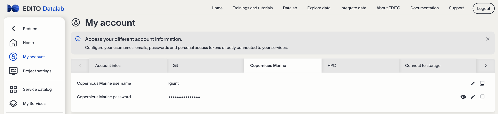  
*Figure 1: Copernicus Marine Data Store credentials*

📌 **For ECMWF data**, create a secret named `"cds"`, containing a variable called `CDS_PERSONAL_ACCESS_TOKEN`. The value of this variable can be found on the [CDS page](https://cds.climate.copernicus.eu/how-to-api):  
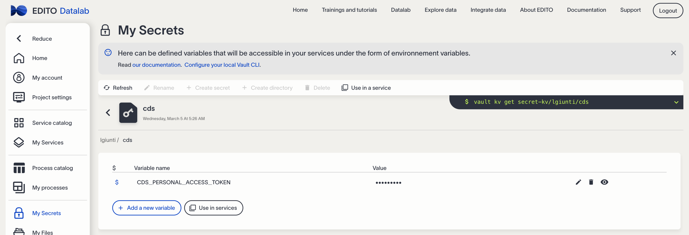  
*Figure 2: Climate Data Store credentials*

---

##  **Using the Service**  

The **SURF-NEMO Service** is available in the **EDITO-Datalab Ocean Modelling Section**.

### 🏁 **Step 1: Login and Service Access**  

1️⃣ **Login** to the **EDITO-Infra Platform**.  
2️⃣ **Navigate** to the **Service Catalogue**, open the **Ocean Modeling** section, and **Select** the **SURF-NEMO Service**.

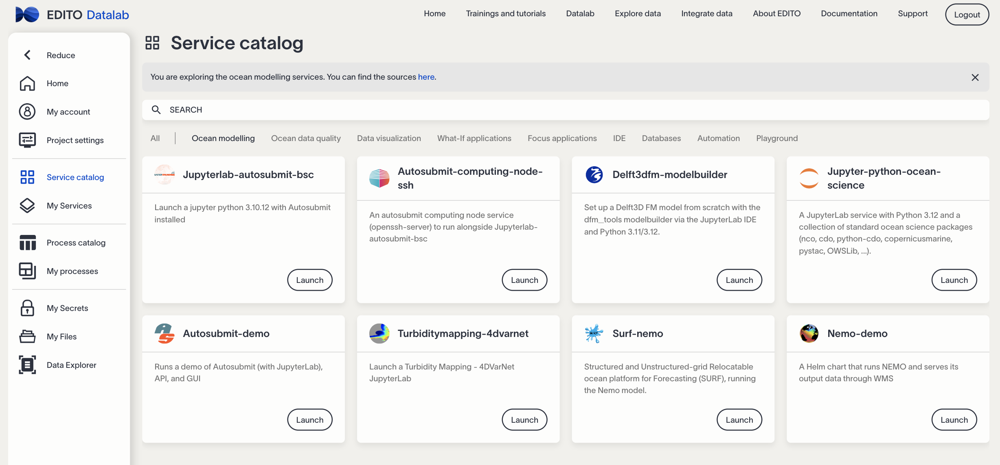  
*Figure 3: SURF-NEMO launcher tile in the EDITO Model Lab*

---

### ⚙️ **Step 2: Configure Your Session**    

1️⃣ **Click the Launch button** to open the **Configuration Panel**.  
2️⃣ **Customize Your Session** by adjusting:
   - **🖥️ Service:** Choose the appropriate service for secure access.
   - **📊 Resources:** Allocate CPU, memory, and storage as needed.

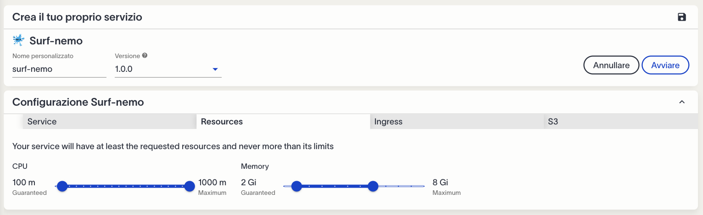  
*Figure 4: Configuration Panel for SURF-NEMO*

---

### 🚀 **Step 3: Service Deployment**  
After configuring your session, click **Launch**. A deployment window will pop up to confirm container deployment.

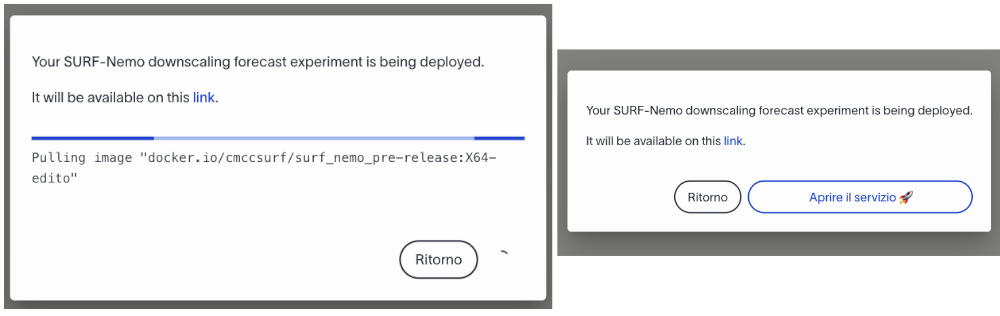  
*Figure 5: Service Deployment Pop-Up*

---

### 🎛️ **Step 4: Using the Web GUI**  

Once the service is deployed, the **SURF Web GUI** opens in a new browser tab.  

🛠️ **Configure the Downscaling Experiment**:  
- 🏷️ **General Parameters**: Define experiment name, duration, and simulation area.  
- 📏 **Grid Generation**: Create or import the model grid.  
- 🌦️ **Surface Boundary Conditions**: Set up atmospheric forcing.  
- 🌊 **Ocean Product Selection**: Choose initial/boundary conditions.  
- ✅ **Data Review**: Verify everything before submission.  

▶️ **Run the Experiment**:  
Click **Run** to start the experiment! The **SURF backend** manages job submissions through the **EDITO-Infra Cloud**.

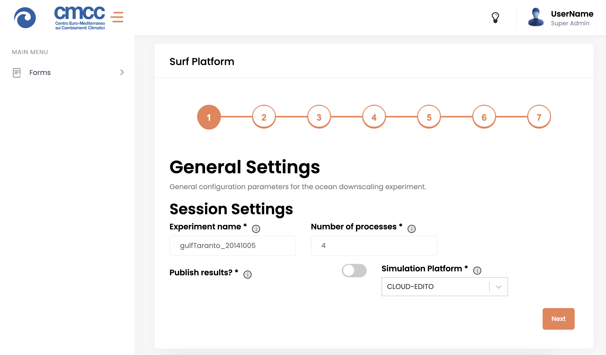  
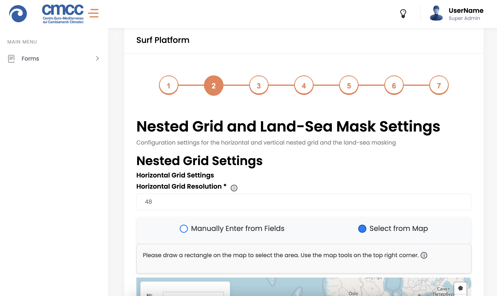  
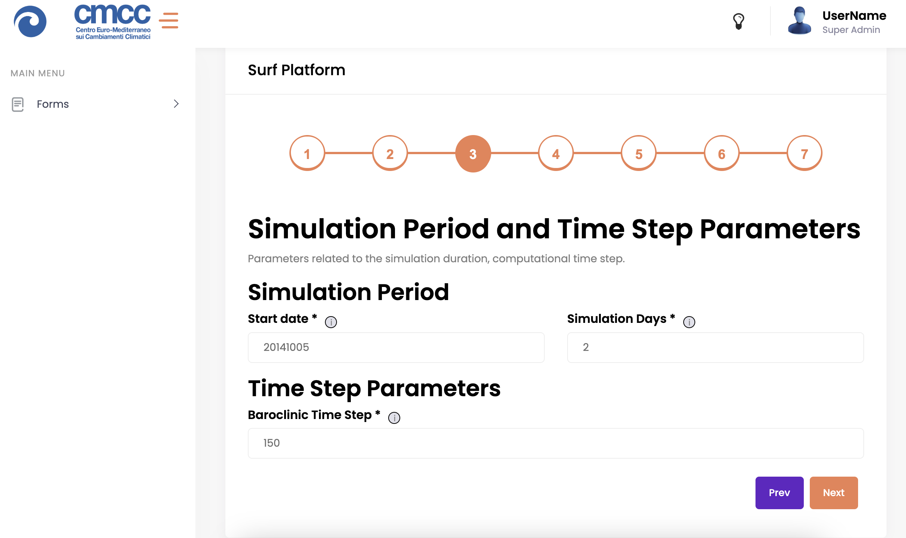  
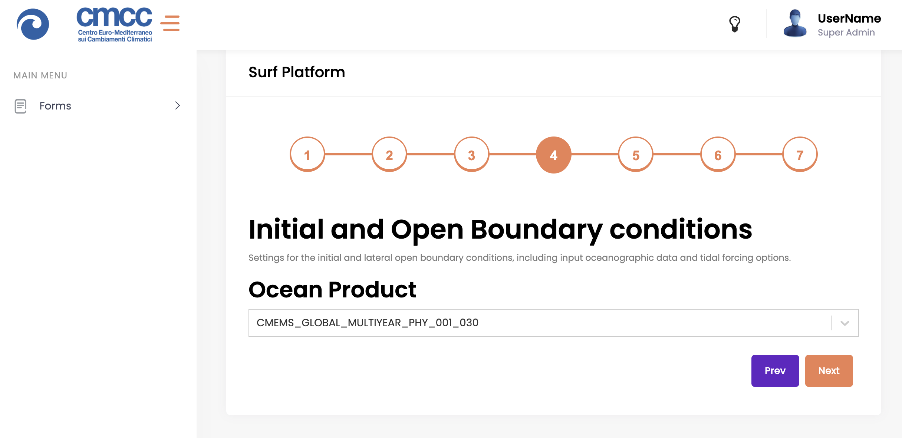  
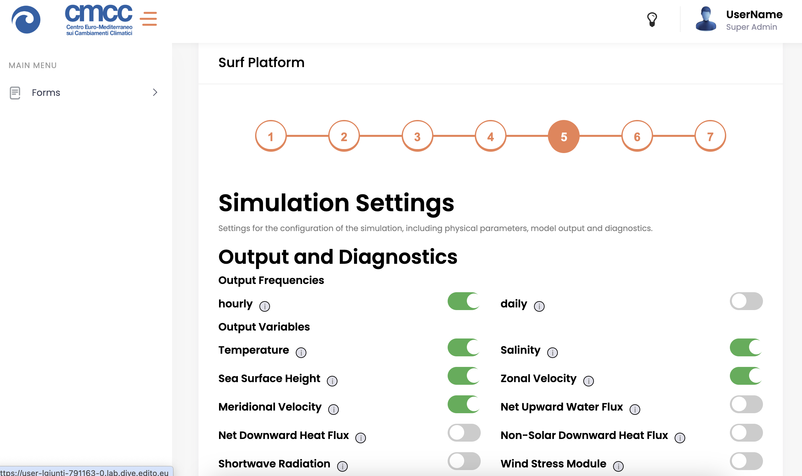  
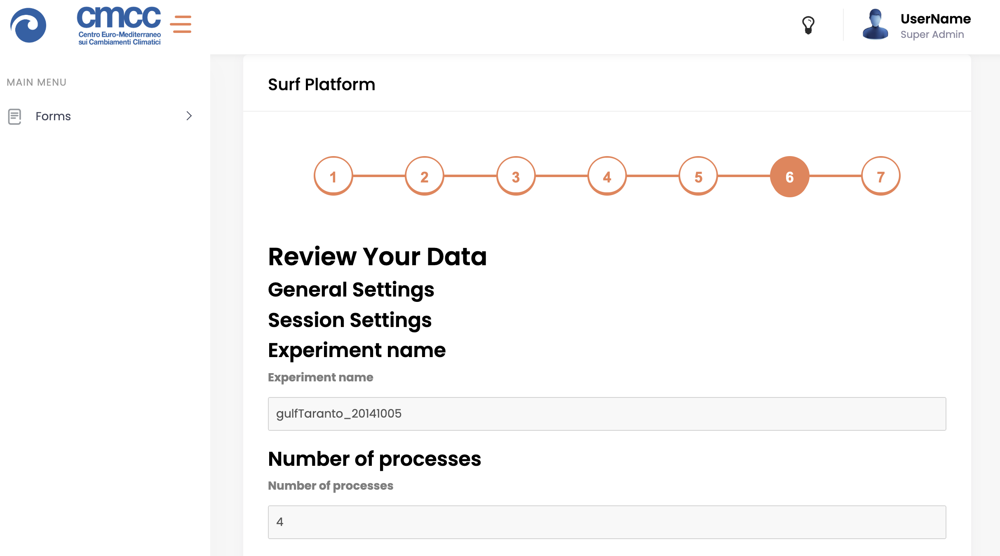  
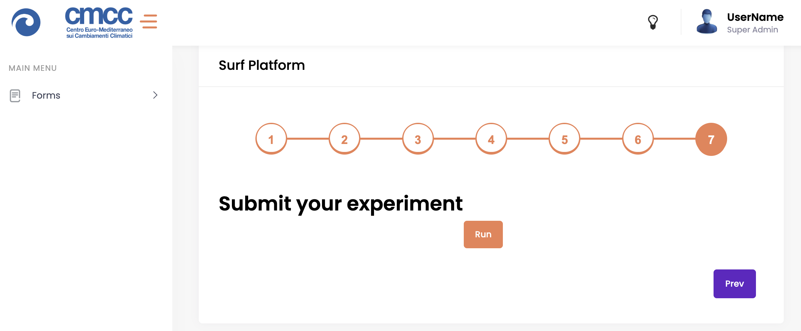  

*Figure 6: Web GUI - Experiment Configuration Steps*

---

### 📂 **Step 5: Accessing Results**  

When the experiment completes, **results** (input/output datasets & generated images) are automatically uploaded to your **personal storage space** for easy access.  

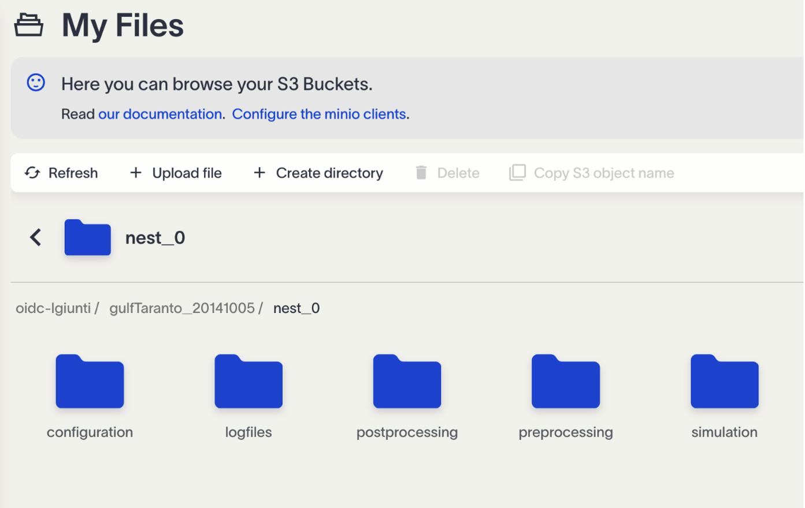  
*Figure 7: Result Upload Confirmation*

---

## 📚 **Video Tutorials**  

🎥 Get started quickly with the [**SURF-NEMO Walkthrough Video**]((./video-tutorials/demo.mp4)) in the **video-tutorials** folder.

---

✨ **You're all set! Happy modeling! 🌊🚀**  
